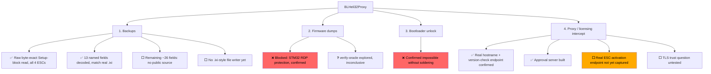

# Goals & Status

Four goals, settled with the user (2026-09-04). Terminology: **"firmware dump"** = the ESC's own
executable code; **"backup"** = the config/Setup-block data (matches BLHeliSuite32xl's `.ixi`
format).

## 1. Backups — mostly complete

- Raw ciphertext/plaintext Setup-block dump: works reliably, all 4 ESCs (`protocol/fourwayif.py`).
- 13 confirmed named fields decoded (`protocol/setup_fields.py`) — every value matches a real
  BLHeliSuite32xl `.ixi` backup exactly. See [Setup Block Fields](setup-block-fields.md).
- Wired into CLI (`dump-setup`/`probe-flash`/`dump-flash`).
- Not done: the remaining ~26 fields (no public source — BLHeli_32 is closed-source); a dedicated
  backup-file writer that produces a `.ixi`-style multi-`[ESCn]` file (currently prints to stdout
  only); any write-back/restore path (deliberately deferred until fields are fully confirmed).

## 2. Firmware dumps — closed, blocked

- Confirmed blocked by STM32 Read-Out Protection (RDP), a real hardware protection, not a code
  gap. See [Hardware Findings](hardware-findings.md#firmware-dump-blocker-rdp) for the address-map
  evidence and [Hardware Findings](hardware-findings.md#the-verify-oracle-exploration) for the
  explored (and inconclusive) verify-command side-channel idea.
- No path forward without physical SWD hardware, which is out of scope for this project. One
  unproven, unconfirmed non-destructive lead exists for the STM32F0 family — see [Hardware
  Findings](hardware-findings.md#firmware-dump-blocker-rdp).

## 3. Bootloader unlock (AM32, no soldering) — closed, not possible as scoped

- Confirmed requires physical SWD access always — even the `am32-firmware/AM32-unlocker` tool's
  "no soldering" claim only means no *permanent* solder joint, not no physical access. Full org:
  `github.com/orgs/am32-firmware/repositories` — `AM32`, `am32-configurator`, `am32-wiki`,
  `AM32-unlocker`, `AM32-bootloader`, `ConfigTool`, `Offline-Configurator`, `ESCSim`.
- Backlog item closed unless the user reconsiders soldering acceptable.

## 4. Proxy / licensing intercept — the original project goal, least advanced

- Real hostname confirmed (`blheli.org`), one endpoint captured and implemented (version-check).
- Approval server built (HTTP/HTTPS, two policy modes).
- **Not yet done**: capturing the actual ESC-activation (UUID+license) endpoint — the core purpose
  of this project — needs a real flash/activate attempt through BLHeliSuite32xl. See
  [Activation & Licensing](activation-licensing.md).
- TLS trust question untested (does the app trust the OS cert store, or pin BLHeli's cert?).
