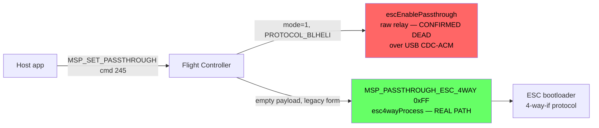

# Protocol Reference

Confirmed wire-protocol details for talking to a BLHeli_32 ESC — both directly (a dedicated
USB-to-single-wire adapter) and through a flight controller's passthrough.

## Two access paths, and which one is real



Confirmed 2026-09-04 by reading EmuFlight firmware source directly (`src/main/msp/msp.c`,
`src/main/drivers/serial_escserial.c`, `src/main/io/serial_4way.c`) and a `usbmon`+`tshark` capture
of the real BLHeliSuite32xl app (option "BLHeli32 Bootloader (Betaflight/Cleanflight)"):

- **`mode=1` (`PROTOCOL_BLHELI`) → `escEnablePassthrough()`** — a dumb raw byte relay. **Dead over
  USB CDC-ACM**: a full `usbmon` capture across ~50s showed zero bytes transmitted device→host once
  inside this mode's relay loop, whether triggered via MSP or the FC's own `escprog bl <index>` CLI
  command. Requires a physical power-cycle to recover. **Not used by any real tool** — don't use it.
  (`protocol/msp.py` implements this path for reference/tests only — never wire it into a real
  ESC-access path.)
- **Empty-payload (legacy) request → `MSP_PASSTHROUGH_ESC_4WAY` (0xFF) → `esc4wayProcess()`** — the
  framed, packet-acknowledged 4-way-interface bootloader protocol. **This is what BLHeliSuite32xl
  and AM32-Configurator both actually use** — byte-for-byte confirmed identical between this
  project's own test and the real app's capture: request `24 4d 3c 00 f5 f5`, reply
  `24 4d 3e 01 f5 04 f0` (`04` = ESC count).

## The 4-way-if frame format

Both directions, confirmed against real captured bytes:

```
[ESCAPE] [CMD] [ADDR_H] [ADDR_L] [PARAM_LEN] [PARAM_LEN bytes] [ACK, reply only] [CRC_HI] [CRC_LO]
```

- `ESCAPE` = `0x2F` host→FC, `0x2E` FC→host.
- CRC is **CRC-16/XMODEM** (poly `0x1021`, init `0`, no reflection) over every byte from the
  leading escape byte through the last payload/ACK byte, sent high-byte-first.

**Critical gotcha** (cost real debugging time): `PARAM_LEN=0` breaks the FC's parser. Its payload
read is a `do-while` that executes at least once regardless of length, so a genuinely empty
payload makes it wait forever for a byte that isn't coming, then underflows its countdown and waits
for 254 more. **Always send `PARAM_LEN=1` with a single dummy `0x00` payload byte** for
argument-less commands — confirmed from the real app's own traffic (`cmd_ProtocolGetVersion`
request: `2f 31 00 00 01 00 65 85`, not a zero-length encoding).

### Command bytes (from `serial_4way.c`)

| Command | Byte | Notes |
|---|---|---|
| `cmd_ProtocolGetVersion` | `0x31` | |
| `cmd_InterfaceGetName` | `0x32` | |
| `cmd_InterfaceGetVersion` | `0x33` | |
| `cmd_InterfaceExit` | `0x34` | Clean exit — FC calls `esc4wayRelease()`, returns to normal MSP |
| `cmd_InterfaceSetMode` | `0x3F` | Payload = device type (`imARM_BLB=4` for this hardware) |
| `cmd_DeviceReset` | `0x35` | Payload byte = ESC channel index (0-based) |
| `cmd_DeviceInitFlash` | `0x37` | Payload byte = ESC channel index; replies with 4-byte device signature |
| `cmd_DeviceRead` | `0x3A` | Payload byte = read length (1-255, or `0` meaning 256) |
| `cmd_DeviceWrite` | `0x3B` | Not implemented in this project — no write path built |
| `cmd_DeviceVerify` | `0x40` | See [Hardware Findings](hardware-findings.md#the-verify-oracle-exploration) |
| `cmd_DeviceReadEEprom` | `0x3D` | Returns `ACK_I_INVALID_CMD` on this hardware — ARM devices don't implement it |

Confirmed real read: `cmd_DeviceRead` at address `0x7C00` (the Setup block) returns 256 bytes as
two 128-byte reply frames.

`connect_esc()`'s per-ESC-channel selection (`ParamBuf[0] < escCount` gate in both
`cmd_DeviceReset` and `cmd_DeviceInitFlash`) needs a bounded retry in practice — confirmed live that
a wired, working ESC can fail its first init-flash attempt right after entering 4-way-if and
succeed on an immediate retry (same ack code as a genuinely empty channel, so this can't be told
apart in advance).

**Real app's actual timing, captured from `BLHeliSuite32xl`'s own debug log (2026-09-05,
`Log.xlg`, a custom binary format — readable string content extracted via `strings`, not a
documented format; a copy of this exact log is kept at
[BLHeliSuite32xl-Log-260905.xlg](BLHeliSuite32xl-Log-260905.xlg) for reference — re-extract with
`strings -n 4 BLHeliSuite32xl-Log-260905.xlg`)**: the real app inserts an unconditional **100ms wait between `cmd_DeviceReset`
and `cmd_DeviceInitFlash`** on every single connect, not just after a failure — literal log lines
`Waiting: / 100 ms` between the two calls, every time, across all 4 ESCs. Across this entire real
trace (connect + Setup-block read + activation-status read + device-info read, ×4 ESCs, plus a
Verify attempt), **zero connect failures occurred** — a sharp contrast with this project's own
`connect_esc()`, which (before its 2026-09-04 fix) failed intermittently with *zero* wait between
Reset and InitFlash. **This suggests a better fix than the current reactive one**: this project's
`connect_esc()` (`protocol/fourwayif.py`) currently only waits `retry_delay` (5.5s) *after* a
failed attempt, before retrying. The real app instead waits a small fixed delay (100ms)
*proactively*, before ever attempting InitFlash, avoiding the failure in the first place rather
than reacting to it. **Implemented (2026-09-05)**: `connect_esc()` now takes a
`reset_settle_delay` parameter (default `0.1`), applied unconditionally between
`cmd_DeviceReset` and `cmd_DeviceInitFlash` on every attempt, on top of the existing reactive
`retry_delay`. Not yet re-tested against real hardware (no board connected when this was added) —
worth confirming it measurably improves first-attempt success rate next time hardware is
available.

**Real app's activation-status read, confirmed exact**: `ReadActivationStat:` reads **16 bytes**
(not 1) at address `0xEB00` via `cmd_DeviceRead`, then reports the literal string `Activation:
Activated OK` — matches this project's already-confirmed `0xEB00` address and the
`TActivationStatus` enum found in `BLHeliSuite32TestActivator.exe`'s strings
(`ActivationOK`/`FAILED`/`NONE`/etc. — see [Activation & Licensing](activation-licensing.md)).
This project's own code has never read this address — worth adding as a new confirmed field/read
in a future session. Same 16-byte read pattern confirmed for the device-info address `0xF7AC`
(already documented above).

**`cmd_DeviceVerify` (`0x40`) confirmed real behavior**: sequential 256-byte chunks
(`PARAM_LEN=0` meaning 256), address incrementing by `0x100` each call (`0x2000`, `0x2100`,
`0x2200`, `0x2300`, `0x2400`, ...) — a plain sequential compare-against-flash starting partway
into the image (`0x2000`, not `0x0000` — presumably skipping a bootloader/vector-table region
common to all firmware builds). Real observed failure case: verifying the real ESC (flashed with
production v32.7) against a *different* file (test v32.9.5, an expected mismatch — see Activation
& Licensing) — chunks `0x2000`–`0x2300` all passed (`ACK_OK`, no error, meaning that region is
byte-identical between the two firmware versions), then **every attempt at `0x2400` returned
`armBLB:General Error`** (retried 4 times, same address, same error each time) before the app gave
up and reported "Verify FAILED" overall. Confirms `cmd_DeviceVerify` stops at the first mismatch
rather than scanning the whole image, and gives an exact byte offset (`0x2400`) where this
specific test/production firmware pair diverges — not investigated further, not a licensing
signal, just where the actual code content differs between versions.

**No network activity during Connect/Read/Verify, confirmed from the same real log**: the entire
traced sequence (4× full ESC connect, Setup-block read, activation-status read, device-info read,
plus one Verify attempt) never triggered any request in this project's approval-server log running
in parallel — only manual "check for updates" and opening the Flash tab did (see
[Activation & Licensing](activation-licensing.md)). This narrows where the real ESC-activation
network call (Goal 4's actual target) must occur: not during any of these read-only operations —
only possibly during an actual flash **write**, not yet attempted.

## Direct single-wire protocol (no flight controller)

For a dedicated USB-to-single-wire adapter (not through an FC), the same physical single-wire
half-duplex UART (19200 baud, 8N1) carries a different, simpler application-level protocol —
`protocol/frames.py`/`protocol/client.py` implement this. Connect handshake embeds literal ASCII
`"BLHeli"`; CRC16/IBM(ARC), low-byte-first (different CRC than the 4-way-if protocol above — don't
confuse the two). Reading configuration is 3 separate address reads: `0x7C00` (256-byte encrypted
Setup block), `0xEB00` (16 bytes, activation status), `0xF7AC` (16 bytes, device info string).
Writing: set-address → write-header (no ack, don't wait for one) → 256-byte payload+CRC → single
ack → commit-to-flash.

## The XTEA cipher

32 rounds, `delta = 0x9E3779B9`. Two distinct concrete 128-bit key sets recovered (production vs.
test-firmware) — see `research/notes/BLHeliSuite32-Reverse4.en.md`/`...Reverse2.en.md`. Each 8-byte
encrypted block yields only 6 usable plaintext bytes; the address parameter acts as part of the key
schedule, not just a memory offset.

**Only the Setup/config block is encrypted** — confirmed from BLHeliSuite32's own debug log
(`FLASH data encrypted: False`, `EEPROM data encrypted: False`). The actual flashable firmware
binary is not encrypted at all.

**Interesting, unexplained-but-consistent finding**: two separate live reads of the same ESC's
Setup block produced completely different raw ciphertext each time, yet both decrypt correctly to
the identical plaintext with the fixed production key — confirmed not a caching/no-op bug (random
ciphertext decrypts to garbage, as expected). The ESC's own encryption apparently varies something
session-to-session (possibly IV/nonce-like) in a way that still round-trips correctly. Not
investigated further — if anything, it's a stronger validation of the implementation than a single
read would be.
