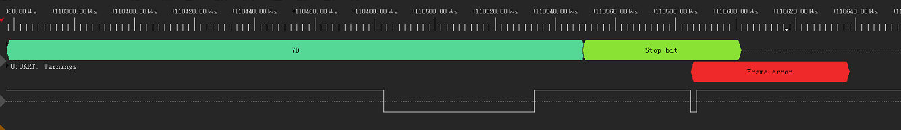
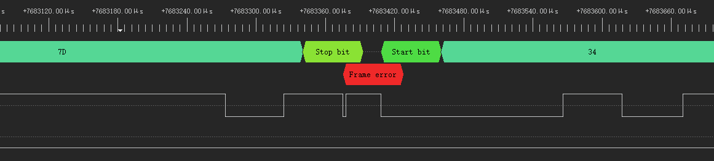

# BLHeli ESC: No UART Response Immediately After Power-On

Source: https://elmagnifico.tech/2021/12/09/BLH-Uart-Timeout/ (2021-12-09)

Short post documenting a specific timing/state-machine bug in BLHeli firmware **31.80+**: the
very first connect attempt right after power-on reliably times out with no ESC reply, even
though the wiring, host TX, and host RX are all provably correct.

## The bug

Boot-time auto-calibration workflow sends the standard connect string immediately on power-up:

```
Host -> ESC: 00 00 00 00 00 00 00 00 00 00 00 00 0D 42 4C 48 65 6C 69 F4 7D
Expected ESC reply: 34 37 31 6C 15 06 07 04 30
```

On affected firmware, this **always** times out on the very first attempt after power-on — the
host switches to RX and waits for a falling edge that never comes, until timeout.

## Debug process

- Ruled out host RX bug (verified with repeated timing/print debugging — no falling edge is
  actually missed, none arrives).
- Ruled out host TX bug (independently wired and read back the transmitted bytes — correct).
- Ruled out simple hardware fault (same code + same wiring on older hardware works 100% of the
  time, every time).
- Confirmed with a logic analyzer capture.

### LICENSING/ACTIVATION RELEVANT — not applicable

This bug is purely a firmware boot state-machine timing issue, unrelated to license/activation
logic — included here only because it's directly relevant to reliably automating ESC connect
sequences, which any proxy/passthrough tool needs to do.

## Logic analyzer findings



On the failing first attempt: right after the last byte of the connect string (`7D`) finishes
transmitting, the analyzer shows an extra low-going pulse on the line that the UART receiver
flags as a **frame error** (a glitch landing where a stop bit should be, at the point where the
half-duplex line direction is being turned around). After this, the ESC never replies at all.



On a subsequent attempt, the **identical frame-error glitch is present**, but this time the ESC
*does* reply correctly and the rest of the exchange proceeds normally. This rules out the
glitch itself as the actual cause (it happens on both the failing and succeeding attempt) — the
real problem is state internal to the ESC's UART/boot state machine that isn't yet in a state
ready to respond on power-up's very first line activity, regardless of whether that first
activity is glitchy.

- The author's own code was pulling the line low at that point (thinking it might be the
  cause); removing that pull had zero effect on the failure — confirming the glitch/pull is not
  the actual root cause of the missing reply.

## Root cause conclusion

The ESC's firmware boot/UART state machine needs to "run through" once (fail once) before it
settles into a state where it will reliably answer. This is treated as a firmware bug in BLHeli
31.80+, not something host-side timing changes can fully avoid.

## Workaround adopted

- Newer BLHeli firmware enforces a **~5 s timeout** after a failed connect before it will
  respond to a retry (older firmware had no such timeout — an immediate retry worked fine).
- Naive fix (just retry after 5 s) is too slow for calibrating multiple ESCs sequentially:
  4 ESCs × one guaranteed-fail-then-5s-wait each ≈ 20+ seconds just in penalty time, on top of
  the ESC's own ~4 s boot time during which comms fail anyway — full calibration pass ballooned
  to ~30 s.
- **Adopted workaround**: for every ESC, send one throwaway `connect` immediately followed by
  `disconnect`, ignoring whether it succeeded — this "uses up" the guaranteed-first-failure
  during a window that doesn't block the real calibration flow. The *next* connect/check cycle
  runs after that and succeeds normally. This gets a full multi-ESC calibration pass down to
  ~10 s. The author notes this is a workaround, not a real fix, and firmware 31.80+ is confirmed
  still affected with no proper resolution as of this post.

## Relevance to this project

Any proxy/tool that automates the connect handshake against a real BLHeli_32 ESC (rather than
just replaying pre-captured host traffic) needs this power-on "prime with a throwaway
connect/disconnect" step, or it will misidentify a genuinely-connected ESC as unresponsive
during the very first attempt after power-up.
