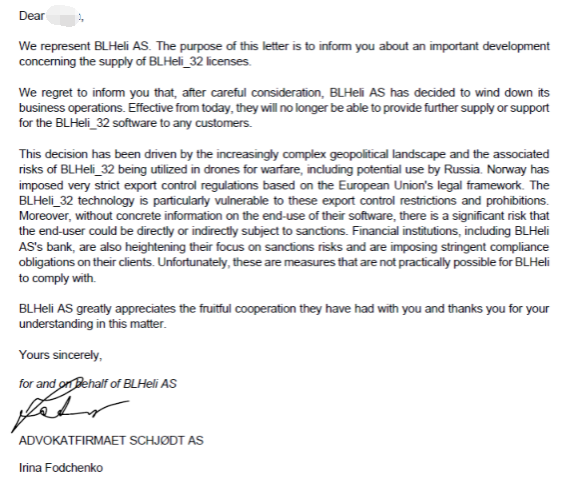
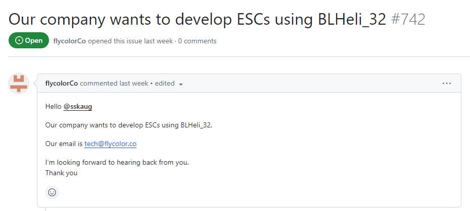
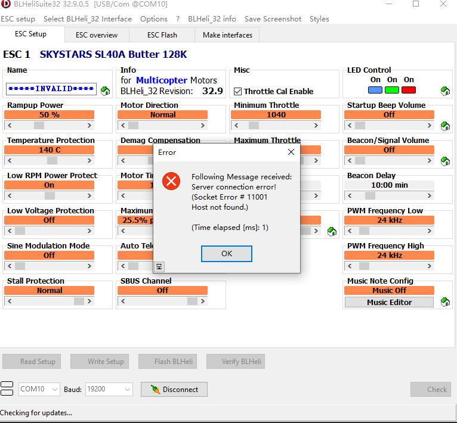
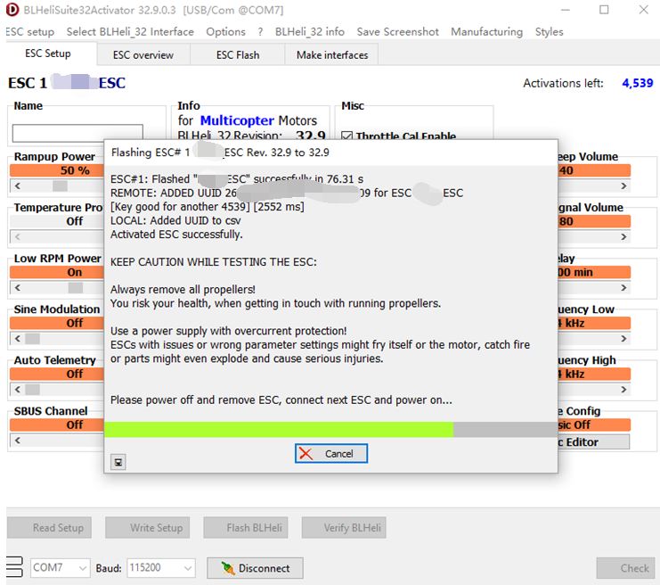

# BLHeli32 Shutdown — Sanctions, Activation Server, and the License Model

Source: https://elmagnifico.tech/2024/06/03/BLHeli-END/ (2024-06-03)

## Background

BLHeli AS (Norway) wound down all BLHeli_32 operations, citing EU/Norwegian export-control
risk over BLHeli_32-equipped ESCs potentially reaching drones used in the Russia/Ukraine war.
Norwegian banking partners also restricted BLHeli AS's ability to receive payment, which the
author says forced the shutdown independent of the export issue.

### LICENSING/ACTIVATION RELEVANT — cease notice



Verbatim legal notice (image 00.png), from Advokatfirmaet Schjødt AS on behalf of BLHeli AS:
BLHeli AS "will no longer be able to provide further supply or support for the BLHeli_32
software to any customers," citing EU export-control law and sanctions-compliance pressure
from BLHeli AS's own bank. Effective immediately, no wind-down period.

## Market position (pre-shutdown)

- BLHeli_32 held an estimated ~90% share of the multirotor ESC market; a typical quad needs 4
  ESCs, so global demand was in the multi-million-unit/year range.
- Timeline: BLHeli launched ~2013 as open-source 8-bit firmware. From 2017 it moved to 32-bit
  MCUs and went closed-source; only the 32-bit line received new features from then on.
- The 8-bit line remained open and still ships in volume for low-end applications.
- For 32-bit, BLHeli charged manufacturers a **per-activation fee, ~1 RMB (~$0.14 USD)** per
  ESC unit for which the firmware is unlocked from trial mode to full/production mode.

### LICENSING/ACTIVATION RELEVANT — license/activation model



*(caption mismatch note: the four numbered images below map to specific claims in the post,
listed in the order they appear in-line)*

- Manufacturers buy licenses in bulk up front: pay `n × price` for `n` activation credits,
  consumed one-per-ESC as units are activated at the factory.
- When the server was cut off, manufacturers still holding **unconsumed license balances (some
  reportedly hundreds of thousands)** lost the ability to activate remaining stock — the
  license pool became worthless with no refund path.
- Separate from the paid/production firmware, BLHeli also shipped a **trial/beta firmware
  variant limited to 100 power-on cycles**, after which the ESC stops functioning. The
  post's author states this limit is almost certainly implemented as a **power-on counter
  stored in flash**, checked during the **bootloader stage**, and considered easy to reverse
  since the check runs before the main application. The author notes some later trial builds
  reportedly dropped the network-check/count limit entirely and could run indefinitely.
- The BLHeliSuite32 host-side configurator is written in **Delphi** and, per the author,
  has no strong obfuscation/protection — making it a second attack surface (see the reverse-
  engineering series `BLHeliSuite32-Reverse[.2/.3/.4]` for how far this was actually taken).
- Author's proposed approach at the time (pre-server-shutdown context): the activation
  handshake runs over **HTTPS**; strategy is to MITM-decrypt the HTTPS layer, downgrade/
  observe it as plaintext, then packet-capture the real request/response to learn the wire
  format — blocked in practice once BLHeli's server actually went offline, since there was no
  live server left to query for capture.

## Live evidence — configurator behavior with the server offline



Screenshot of BLHeliSuite32 32.9.0.5 connected to a real ESC (SKYSTARS SL40A Butter 128K,
BLHeli_32 rev 32.9) with the activation server unreachable:
- ESC **Name field reads `****INVALID****`** — the configurator marks a previously-activated
  ESC's identity as invalid once it cannot reach the license server, even for read-only setup.
- Popup: `Following Message received: Server connection error! (Socket Error #11001 Host not
  found.) (Time elapsed [ms]: 1)` — classic Winsock DNS-resolution failure; the activation
  hostname itself no longer resolves.
- **Implication for this project**: the configurator's normal (non-manufacturer) build appears
  to call home even for *setup/read* operations on an already-activated ESC, not just at first
  flash — a MITM/local-DNS or local-server substitute needs to answer whatever hostname it's
  resolving, not just intercept a one-time activation POST.


GitHub comment from BLHeli maintainer `sskaug` (2 days before this post), apologizing for "this
current server operation interruption" and stating they're "working very hard to get the
required clarifications to put it back in operation" — confirms the outage was already visible
to users before the formal shutdown letter, and that server-side activation was a known single
point of failure even during normal operation.

### LICENSING/ACTIVATION RELEVANT — manufacturer activator tool, full wire-level behavior



This is the single most important image in the corpus for this project's goal. It shows
`BLHeliSuite32Activator` 32.9.0.3 — a **manufacturer-specific build**, distinct from the
retail `BLHeliSuite32` configurator — mid-flash on a real ESC, with this exact log output:

```
Flashing ESC# 1 [ESC name] ESC Rev. 32.9 to 32.9
ESC#1: Flashed "[firmware name]" successfully in 76.31 s
REMOTE: ADDED UUID 26...39 for ESC [ESC name] ESC [Key good for another 4539] [2552 ms]
LOCAL: Added UUID to csv
Activated ESC successfully.
```

Header also shows **`Activations left: 4,539`**.

This confirms the end-to-end activation protocol shape:
1. Flash the firmware image to the ESC over the normal serial/bootloader link (unrelated to
   licensing — see `BLHeli-Uart-Usb-Protocol.en.md`).
2. Read a **per-chip UUID** from the flashed ESC (hex, e.g. `26...39` — truncated in the
   screenshot but implies a 16+ byte or long hex identifier, likely derived from the MCU's
   factory-programmed unique ID).
3. Make a **REMOTE** call — almost certainly HTTPS POST — to BLHeli's activation server,
   submitting `{ESC name/type, UUID}`; the server replies with confirmation plus a **remaining-
   activations counter** for that manufacturer's license key (`[Key good for another 4539]`),
   round-trip time logged as 2552 ms.
4. On success, the tool **also writes the UUID to a local CSV** (`LOCAL: Added UUID to csv`) —
   i.e., the activator keeps its own local ledger of every UUID it has activated, independent
   of the server's count. A proxy/re-licensing server for this project should replicate both
   halves: answer the REMOTE call *and* expect the client to keep writing its own local CSV
   regardless.
5. The visible per-manufacturer-key counter (`Activations left: N`) is exactly the value that
   ran out or became unreachable for manufacturers when BLHeli's server was pulled — this is
   the counter this project would need to own/serve to keep manufacturer tooling functional.

## Community / manufacturer reaction


GitHub issue #742 on `bitdump/BLHeli`, opened by `flycolorCo` (Flycolor, a Chinese ESC
manufacturer — matches "飞盈佳乐" named in the post's body): *"Our company wants to develop
ESCs using BLHeli_32... Our email is tech@flycolor.co"* — directed at maintainer `sskaug`,
illustrating manufacturer pressure to keep BLHeli_32 licensing alive after the shutdown, and
that at least one major Chinese ESC vendor had no insider access to the activation server
either (they're asking, not already possessing a bypass).

## Open-source alternatives named in the post

- **AM32** — https://github.com/am32-firmware/AM32 — C-based, newer, some ESCs are hardware-
  compatible with BLHeli_32 designs, but the post notes switching an ESC to AM32 is a one-way
  door: once flashed, the BLHeli_32 activation state/right is gone and can't switch back.
- **Bluejay** — https://github.com/mathiasvr/bluejay — continuation of the 8-bit BLHeli
  lineage, ports over most 32-bit new features, but the post says it still lags BLHeli_32 on
  some performance metrics.

## Relevance to this project

This post is the strongest evidence for *why* a MITM/relicensing proxy is needed at all (the
vendor's real server is gone, both for retail configurator use and for manufacturer factory
activation) and gives the **only concrete wire-behavior evidence in this corpus of the actual
REMOTE activation call**: UUID-keyed, counter-decrementing, over what the author states is
HTTPS. The `BLHeliSuite32-Reverse*` series (see companion notes) is the deeper reverse-
engineering of the configurator binary and protocol that a working proxy would need to
replicate this REMOTE call's exact request/response format.
