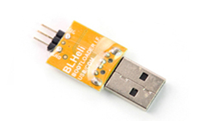

# BLHeli Core UART Protocol (4way-if / USB-COM / BF-passthrough)

Source: https://elmagnifico.tech/2020/06/03/BLHeli-Uart-Usb-Protocol/ (2020-06-03)

This is the single most detailed protocol-level post in the corpus: full byte-level command/
response captures for connect, keep-alive, disconnect, read-config, and write-config, plus a
working CRC implementation and a Python dump/decode helper script. **This protocol is the
direct target for a MITM proxy** — everything below is what must be intercepted, parsed, and
optionally rewritten.

## Background / prior art referenced

- BLHeli went closed-source at the 32-bit transition; the host-side configurator protocol
  (BLHeliSuite) is also closed source from `4712/BLHeliSuite`.
- The passthrough implementation is exposed inside two open flight-controller stacks, which is
  how the author (and this project) can study it without disassembling the binary:
  - https://github.com/betaflight/betaflight (original source of the passthrough code)
  - https://github.com/ArduPilot/ardupilot (ported from Betaflight)
- The older 16-bit BLHeli protocol is fully open and documented:
  https://github.com/4712/BLHeliSuite/blob/master/Manuals/BLHeliSuite%204w-if%20protocol.pdf
- A third-party open web configurator exists: https://esc-configurator.com/
  (https://github.com/stylesuxx/esc-configurator) — but it only relays through Betaflight's MSP
  → 4way-if bridge, it does not implement the raw BLHeli UART protocol directly. Not usable as
  a drop-in reference for a standalone MITM proxy that must speak the wire protocol itself.

## Three "interfaces", one core protocol



BLHeli exposes what looks like three distinct interfaces, but all three carry the same core
protocol over a single logical wire:

1. **4way-if** — SPI-like: GND, MISO, MOSI, plus one chip-select line per ESC (more ESCs = more
   CS lines). A 2-wire variant also exists using just GND + SIG per ESC (SIG doubling as CS).
2. **USB-COM** — a small USB↔single-wire-serial adapter board (pictured above, sold as "BLHeli
   电脑USB 调参适配 连接器" / "USB转串口BL"). It's a transparent passthrough onto the same
   GND+SIG serial link — the author's entire capture in this post was taken by sniffing this
   adapter's serial line while BLHeliSuite talked to a real ESC.
3. **Betaflight/Cleanflight passthrough** — flight controller's USB port relays the protocol
   through MSP, but underneath it's still transparent passthrough to the same GND+SIG protocol.
   Implementing this path requires implementing Betaflight's MSP protocol *and* the 4way-if
   layer on top of the core protocol below — noted as unnecessary complexity if direct ESC
   access is available.

**Conclusion: the actual protocol to implement/intercept is the single-wire serial protocol**,
independent of which of the three transport wrappers carries it.

## Physical / link layer

- Single-wire UART: **19200 baud, 8 data bits, no parity, 1 stop bit (8N1)**.
- Runs half-duplex over the ESC's single SIG line — TX and RX are multiplexed onto the same
  wire; software must switch direction fast (~52 µs measured turnaround) or the ESC's reply
  gets missed because the line isn't pulled up in time.
- All multi-byte messages carry a **16-bit CRC**, algorithm **CRC-16/IBM** (a.k.a. CRC-16/ARC),
  transmitted **low byte first, then high byte**. Verify against http://www.ip33.com/crc.html
  using the "CRC-16/IBM" preset.
- Reference CRC implementation given in the post (C):

```c
uint16_t esc_crc(const uint8_t *buf, uint16_t len)
{
    uint16_t crc = 0;
    while (len--) {
        uint8_t xb = *buf++;
        for (uint8_t i = 0; i < 8; i++) {
            if (((xb & 0x01) ^ (crc & 0x0001)) != 0) {
                crc = crc >> 1;
                crc = crc ^ 0xA001;
            } else {
                crc = crc >> 1;
            }
            xb = xb >> 1;
        }
    }
    return crc;
}
```

Second equivalent form given later in the post (same algorithm, byte-XOR-first form):

```c
// cal crc 16 IBM
uint16_t crc = 0;
uint8_t data_t;
int i=0,j=0;
for (j = 0; j < sizeof(reply_settings); j++){
    data_t = reply_settings.bytes[j];
    crc = (data_t ^ (crc));
    for (i = 0; i < 8; i++){
        if ((crc & 0x1) == 1){
            crc = (crc >> 1) ^ 0xA001;
        } else {
            crc >>= 1;
        }
    }
}
uint8_t crc1 = crc & 0x00FF;
uint8_t crc2 = (crc & 0xFF00) >> 8;
```

## Startup-tune interaction warning

If the ESC's startup beep/tune is enabled, the ESC ignores all throttle/PWM input while the
tune plays, and — critically — **it will keep ignoring an input value that hasn't changed even
after the tune finishes** (e.g. if PWM was already sitting at 1000 during the tune, it stays
"latched off" until the value actually changes away from 1000). Configuration tooling should
either disable the startup tune or wait for it to finish before talking to the ESC.

## Command/response protocol (verbatim captures)

Every multi-byte command's trailing two bytes are the CRC-16/IBM of the preceding bytes,
low-byte-first. Every accepted command gets a **single-byte ACK reply of `30`** unless noted.

### Connect

```
Host -> ESC: 00 00 00 00 00 00 00 00 0d 42 4C 48 65 6C 69 F4 7D
ESC -> Host: 34 37 31 6A 33 06 07 04 30
```

- The leading `00`s are effectively a bus-idle/boot-unlock preamble — sending a long run of
  pure `00`s *alone* is treated as invalid and can lock the ESC's link for ~5 s before it
  recovers. The `0d` byte appears inconsistently across ESCs and seems to carry no meaning.
- The bytes that actually matter are `42 4C 48 65 6C 69 F4 7D` — ASCII `BLHeli` followed by its
  CRC (`F4 7D`). The leading zero-run before it is what the post calls a "bus activation"
  gesture — it must put the ESC in an unlocked/boot state before the real connect string will
  parse. If the ESC's output was already driven to all-zero PWM beforehand, the real command
  can be sent directly without the zero preamble.
- Reply breakdown: `34 37 31` = ASCII `"471"` — a fixed literal that appears at the start of
  every connect reply (`4712` project header, truncated). Final `30` = ACK. In between, `33 06`
  decodes as big-endian `0x3306`, an exact match for the `imARM_BLB` case in the device-type table
  below — so the **device/MCU-type word** is somewhere in that middle span. **Caveat found during
  implementation verification**: the reply is 9 bytes total (`34 37 31 6A 33 06 07 04 30`), and
  `"471"` (3 bytes) + the device-type word (2 bytes) + ACK (1 byte) only account for 6 of them —
  bytes `6A` (position 3) and `07 04` (positions 6-7) are present in the real capture but **not
  explained anywhere in the original source post**, which glosses over them entirely. Don't assume
  the device-type word sits at a fixed offset from this one example alone; a robust parser should
  scan for a known code from the table below rather than hardcode a byte position (see
  `blheli32proxy.protocol.frames.parse_connect_reply` for the implementation this drove).

Device-type decode table (from the referenced host source):

```c
uint16_t *devword = (uint16_t *)blheli.deviceInfo[blheli.chan];
switch (*devword) {
case 0x9307:
case 0x930A:
case 0x930F:
case 0x940B:
    blheli.interface_mode[blheli.chan] = imATM_BLB;   // Atmel bootloader
    break;
case 0xF310:
case 0xF330:
case 0xF410:
case 0xF390:
case 0xF850:
case 0xE8B1:
case 0xE8B2:
    blheli.interface_mode[blheli.chan] = imSIL_BLB;   // Silicon Labs bootloader
    break;
case 0x1F06:
case 0x3306:
case 0x3406:
case 0x3506:
case 0x2B06:
case 0x4706:
    blheli.interface_mode[blheli.chan] = imARM_BLB;   // ARM bootloader
    break;
default:
    blheli.ack = ACK_D_GENERAL_ERROR;
    break;
}
```

- Note: there is no CRC on the connect *reply* — only host→ESC commands carry the CRC suffix in
  this capture.
- If a connect is sent without a matching disconnect afterward, the next connect attempt gets
  no reply at all — connect/disconnect should always be paired. If stuck, the author's recovery
  recipe is: send disconnect, wait 1 s, send a run of `00`s, then retry connect.
- ArduPilot's port waits 1 s between every command (very conservative); the author found this
  unnecessary — a 5 s timeout-then-retry is only needed on actual comms errors, and in practice
  only a **1 ms inter-command delay** was needed for the ESC to recognize the next command
  reliably (omitting even that 1 ms caused missed command recognition).

### Keep-alive

```
Host -> ESC: FD 00 40 90       (40 90 = CRC)
ESC -> Host: C1
```

Nominally sent once per second while connected, but any other command also counts as activity.
The author found the ESC keeps responding fine even without ever sending the keep-alive.

### Disconnect

```
Host -> ESC: 00 01 C1 C0       (C1 C0 = CRC)
ESC -> Host: 30
```

Reconnect timing constraints (measured on test-firmware ESCs): if disconnect happens
immediately after connect (no reads/writes done), the next connect needs **≥5 s** before it
will succeed; if a read/write happened first, the next connect needs **≥10 s**.

### Read configuration — three fixed addresses, always read in this order

**Address 1 — `0x7C00` (the real 256-byte config block, encrypted):**

```
Host -> ESC: FF 00 7C 00 10 D4      set address to 0x7C00 (10 D4 = CRC)   -> ACK 30
Host -> ESC: 03 00 00 F0            read 256 bytes (03 00 = length; 00 F0 = CRC)
ESC -> Host: <256 bytes of data> <2-byte CRC of the 256 bytes> <ACK 30>   (259 bytes total)
```

**Address 2 — `0xEB00` (16 bytes, purpose unclear):**

```
Host -> ESC: FF 00 EB 00 7E E4      set address                          -> ACK 30
Host -> ESC: 03 10 01 3C            read 16 bytes (03 10 = length; 01 3C = CRC)
ESC -> Host: 00 00 00 01 F5 02 00 00 00 00 00 00 00 00 00 00 <CRC:46 34> <ACK 30>
```

The 3rd/4th/5th bytes (`01 F5 02` in this capture) vary between reads and the author suspects
they correlate with elapsed power-on time (larger soon after boot, trending to all-zero the
longer power has been on); no observed effect on configuration, and nothing writes to this
address — possibly throttle-calibration-related state, unconfirmed.

**Address 3 — `0xF7AC` (16 bytes, fixed/constant):**

```
Host -> ESC: FF 00 F7 AC 76 59      set address                          -> ACK 30
Host -> ESC: 03 10 01 3C            read 16 bytes (same length/CRC as above)
ESC -> Host: 41 00 4F 00 11 57 42 46 36 36 34 20 DE 06 EC 05 <CRC: 26 BF> <ACK 30>
```

Verified: the 16-byte payload above is exactly `41 00 4F 00 11 57 42 46 36 36 34 20 DE 06 EC 05`
— CRC-16/IBM of those 16 bytes is `26 BF` (low byte first), matching the captured trailer exactly.
(An earlier version of this note mis-split the boundary at 12 payload bytes, mistaking the first
2 CRC-looking bytes `DE 06` for the start of the checksum; confirmed and fixed by recomputing the
CRC against the correct 16-byte split.)

This block is bit-for-bit identical on every read regardless of configuration changes — the
author flags `42 46 36 36 34 20` as decoding to ASCII `BF664 ` (with a trailing space), looking
like an ESC/firmware identifier string, meaning **this may be a stable per-firmware or
per-hardware ID string worth checking against for device fingerprinting**, though the post does
not confirm its exact semantic role.

Only address `0x7C00`'s 256 bytes is confirmed to be the actual live configuration; the other
two addresses are read every time by the stock configurator but their content doesn't appear to
be used for anything the author could identify.

### Write configuration

Three-step sequence: set address, push 256+2 bytes, commit to flash.

```
Step 1 (set address, same as read): FF 00 7C 00 10 D4          -> ACK 30
Step 2 (push new config):
    Host -> ESC: FE 00 01 00 30 78                  (header, no ACK expected here)
    Host -> ESC: <256 bytes new config> <2-byte CRC of those 256 bytes>
    ESC -> Host: 30                                  (ACK only after the full 258 bytes land)
Step 3 (commit to flash/EEPROM):
    Host -> ESC: 01 01 C0 50            (C0 50 = CRC)          -> ACK 30
```

- Critically: **no ACK follows the `FE 00 01 00 30 78` header itself** — send the 256+2 bytes
  immediately after it without waiting for any ack in between. The reference host source
  incorrectly waits for a "None ack" there; the author found this wait can itself cause a
  command timeout that invalidates everything sent afterward, so the final ACK is never seen.
  **Do not wait between the write-header and the payload.**
- BLHeliSuite's own logic always does read→write→read-verify, but since the 256-byte block is
  encrypted and this project can't decrypt/compare it, a straight write without the verify-read
  is equivalent for our purposes.

### The 256-byte configuration block is encrypted

- Confirmed **not asymmetric** — no key-exchange handshake exists between host and ESC.
- The key material is believed to live inside the 256-byte block itself.
- Not a simple substitution/Caesar cipher — the author tested with repeated identical plaintext
  values and found no exploitable pattern.
- The **same logical configuration produces a completely different 256-byte ciphertext on every
  single read** (confirmed by the raw test capture below, which reads the identical config 3
  times in a row and gets 3 different byte sequences each time) — meaning either an IV/nonce or
  a stream-cipher-like keystream that changes per-session, not a static block cipher.
- For decryption method, the post points to the separate `BLHeliSuite32-Reverse` series (see
  companion notes `BLHeliSuite32-Reverse*.en.md`) — this post only documents the wire protocol
  around the encrypted blob, not how to decrypt it.

## Full raw test capture (three consecutive read cycles + one write + disconnect)

Kept verbatim for reference/replay — this is real traffic from a physical ESC and can be used
to validate an independent protocol implementation byte-for-byte (connect strings, keep-alives,
three-address reads producing three *different* ciphertexts for address `0x7C00` each time,
one write cycle, and final disconnect `00 01 C1 C0` → ACK `30`):

```
FD 00 40 90 C1 FD 00 40 90 C1 FD 00 40 90 C1 FD 00 40 90 C1 FD 00 40 90 C1 FD 00 40 90 C1
FD 00 40 90 C1
FF 00 7C 00 10 D4 30
03 00 00 F0 1A 82 89 C7 48 0D 68 49 86 12 68 B9 24 BE D3 2E 5E 3F 0D 3A 31 A4 25 C2 C7 2F D8
FA 3B 8C 8C 54 CE C8 A6 9C 89 89 58 FB 0A 7F CF 28 8A 14 74 0C 26 95 6F C8 57 00 E0 1D 4C 93
08 2E 88 21 1A FC 85 AD 98 72 7E 61 8C 44 91 B6 3F F2 CB 34 ED 3D FD 21 93 67 92 36 38 1C DA
BB F9 2C FE 35 4D A9 C4 3E 5B E0 3E 59 86 46 A8 E1 7A 98 4A D7 AB 16 40 69 74 57 4F CA CD 15
F0 6E 75 88 F3 9D 1E 1D 33 0C 38 CA 5C 30 39 21 86 1E 3C 53 F6 60 70 41 D8 BB A5 F9 AB E9 1D
AB 53 D1 D9 D0 FF 49 0B DB 66 4B F4 7E AE FC 4D 00 4D 32 10 B7 E5 2E 91 9F F7 B4 0A F7 0F E0
79 8B 40 C5 E8 68 BB 49 5E 79 E1 39 C4 20 36 6E 16 0F BF 1F 1A 79 68 7E FD 7F 59 DD BC FA 7C
6B C6 34 94 AC 03 E1 A5 51 41 A3 EC F7 24 35 AD ED 35 DD 6E 13 B2 19 47 10 C7 05 73 29 51 55
42 33 12 D1 E8 09 74 16 41 3C C8 3F 03 ED 30
FF 00 EB 00 7E E4 30
03 10 01 3C 00 00 00 00 00 00 00 00 00 00 00 00 00 00 00 00 00 00 30
FF 00 F7 AC 76 59 30
03 10 01 3C 41 00 4F 00 11 57 42 46 36 36 34 20 DE 06 EC 05 26 BF 30
FF 00 7C 00 10 D4 30
FE 00 01 00 30 78 9D D7 DE 3F 49 2D 26 30 F4 A6 83 20 1F 72 9B 81 E3 CE AD 4F A7 36 6F 59 45
27 DD B0 83 F2 C5 E8 41 7E E2 D3 C6 40 15 86 8A 3E AC E1 EE AC E6 E6 A4 4D 77 95 B6 58 B0 7F
C6 94 C4 1D F4 44 28 70 47 4C 1E 56 A0 D9 41 CB 33 06 14 A5 50 7F 4C 09 1C F6 21 4A E1 DB AD
71 3E 5D AF C4 E4 A6 AE 5F DA 31 31 8D 5F 4C D3 C8 80 FE 5C D3 E1 40 60 61 72 DE 32 D5 1B 99
76 FA 3C 2D C8 E1 27 43 66 8E 59 61 51 D9 E4 70 47 D2 7D 8D 6C 09 70 6E 58 10 1D DD 09 80 F9
0B 94 9E 7F 5A 7C FE 7B CF 91 66 0C 90 60 32 7E 6C 02 33 3D D3 6F 85 3E 00 B3 F2 55 A0 A1 6B
E9 F4 F7 82 F1 53 68 56 E7 1E 05 25 49 E2 53 91 8F 07 7F 54 0A 95 8F 99 CE ED 5F 71 77 EC B6
F3 CC 40 C7 D7 C7 C0 E2 27 08 F3 50 0E 61 CF 1D 18 E0 3A 61 A8 BF 6F 52 2C 34 3D 54 B6 8E E3
30 37 53 3E 0E BF FC D5 74 A7 5C 3F 0B 67 AF 1F 30
01 01 C0 50 30
FF 00 7C 00 10 D4 30
03 00 00 F0 <256 more bytes, third and different ciphertext for the same 0x7C00 block — see
notes/BLHeli-Uart-Usb-Protocol.zh.md lines 653-666 for the exact bytes if needed> 30
FF 00 EB 00 7E E4 30
03 10 01 3C 00 00 00 00 00 00 00 00 00 00 00 00 00 00 00 00 00 00 30
FF 00 F7 AC 76 59 30
03 10 01 3C 41 00 4F 00 11 57 42 46 36 36 34 20 DE 06 EC 05 26 BF 30
FD 00 40 90 C1
FD 00 40 90 C1
00 01 C1 C0 30
```

(Full byte-exact capture preserved in the Chinese source note
`notes/BLHeli-Uart-Usb-Protocol.zh.md` if a canonical copy is needed for test fixtures.)

## Sniffing/dump tooling used by the author

Hardware/procedure to capture a live BLHeliSuite32 session:
1. Wire a second UART (19200 baud) in parallel, RX tied to the ESC signal line, common ground
   with ESC/configurator adapter.
2. Power the ESC with no PWM/flight-controller signal present.
3. Open a serial terminal in hex mode on the sniffing UART.
4. Connect with BLHeliSuite32, read config, change a setting, write config — the sniffer
   captures every byte exchanged.
5. Paste the captured hex into `rawdata.txt`, run the author's `get_settings.py` (below) to
   auto-extract the write-payload into `settings.txt`.
6. **Gotcha noted by the author**: if the written config is identical to what's already on the
   ESC, the resulting captured payload may not reflect a real change — always change to a
   different setting first before dumping a "known-good write" capture.

```python
import sys
import os

f = open(os.path.dirname(__file__) + "/rawdata.txt")
hex_data = f.read()
print hex_data

start = None
end = None
state = 0
for i in range(0, len(hex_data), 3):
    if (hex_data[i] + hex_data[i + 1]) == "FE" and state == 0:
        state = 1
    elif (hex_data[i] + hex_data[i + 1]) == "00" and state == 1:
        state = 2
    elif (hex_data[i] + hex_data[i + 1]) == "01" and state == 2:
        state = 3
    elif (hex_data[i] + hex_data[i + 1]) == "00" and state == 3:
        state = 4
        start = i - 9
        break
    else:
        state = 0

if start == None:
    print "no start,exit"
    sys.exit(0)

state = 0
for i in range(0, len(hex_data), 3):
    if (hex_data[i] + hex_data[i + 1]) == "30" and state == 0:
        state = 1
    elif (hex_data[i] + hex_data[i + 1]) == "01" and state == 1:
        state = 2
    elif (hex_data[i] + hex_data[i + 1]) == "01" and state == 2:
        state = 3
    elif (hex_data[i] + hex_data[i + 1]) == "C0" and state == 3:
        state = 4
        end = i - 9
        break
    else:
        state = 0

if end == None:
    print "no end,exit"
    sys.exit(0)

output_data = ""
n = 4
for i in range(start, end, 3):
    output_data += "0x" + hex_data[i] + hex_data[i + 1] + ','
    n += 1
    if n % 24 == 0:
        output_data += "\n"

f.close()
f = open(os.path.dirname(__file__) + "/settings.txt", 'w')
f.write(output_data[:-1])
print output_data[:-1]
```

(Written in Python 2 syntax — `print hex_data` statement form — needs a Python 3 port for this
project's tooling.)

## Interface capability summary (from the post's closing notes)

- **4way-if**: supports multiple ESCs simultaneously (separate CS per ESC), can read/view all
  at once.
- **USB-COM**: one ESC at a time only.
- **Betaflight/Cleanflight passthrough**: doesn't need direct ESC wiring, but requires
  implementing Betaflight's MSP protocol on top, translating to 4way-if, then to this core
  protocol — significantly more complex than talking to the ESC directly, and not worth it
  unless direct wiring genuinely isn't available.

## Relevance to this project

This is the exact protocol a MITM proxy/relay needs to parse and forward (or answer on the
ESC's behalf): connect handshake, keep-alive, the three fixed-address reads (only `0x7C00`
matters for config), the three-step write sequence, and the CRC-16/IBM checksum used throughout.
The 256-byte block's per-read ciphertext variability is the key open problem for any tool that
wants to *modify* configuration content rather than just pass it through unchanged — see
`BLHeliSuite32-Reverse*.en.md` for the decryption approach.
