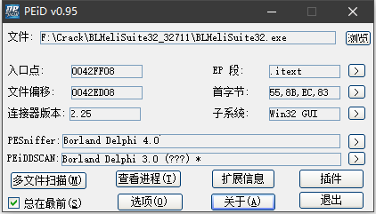
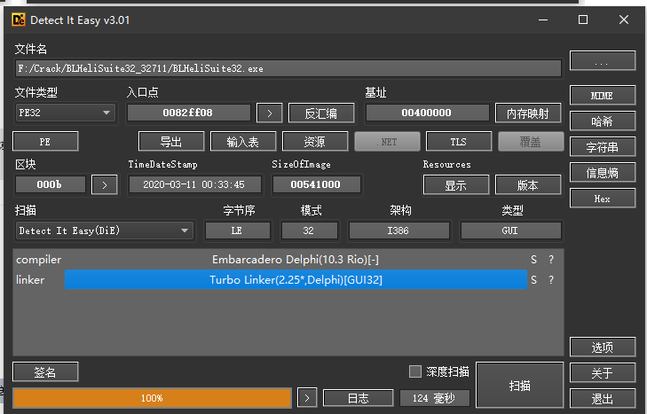
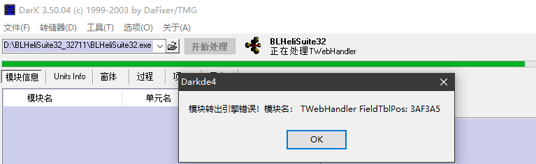
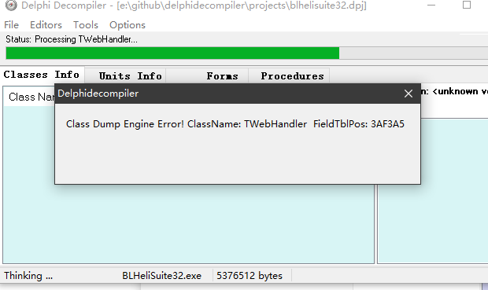
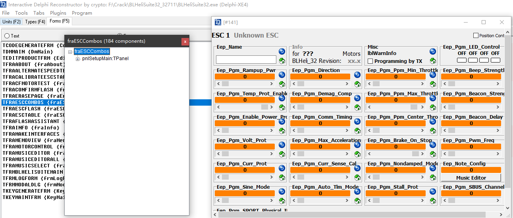
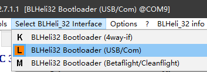
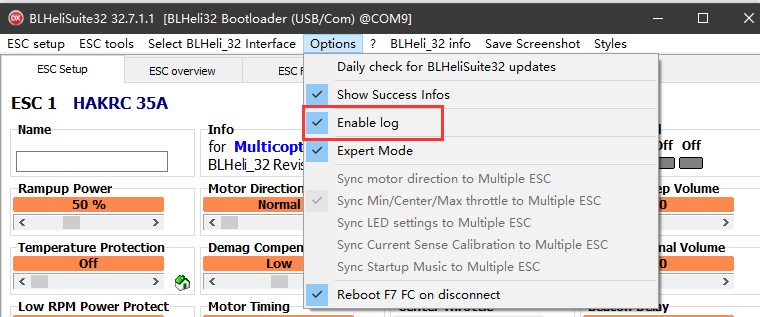
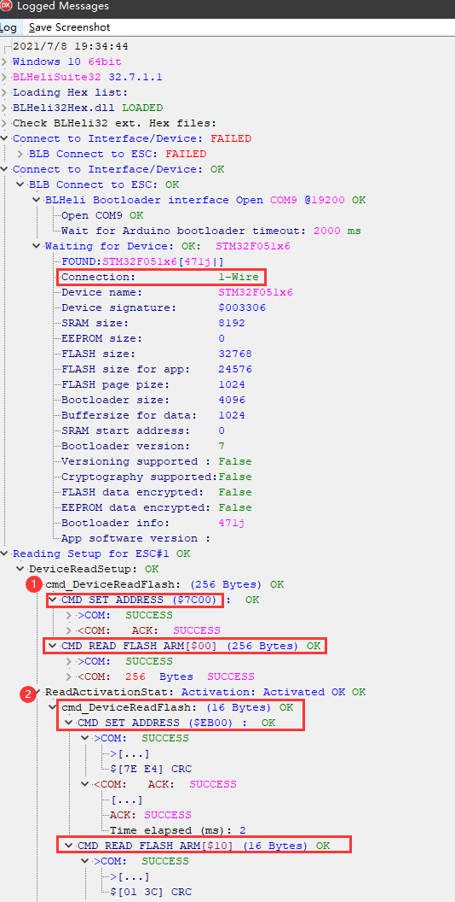
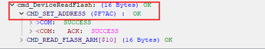

# BLHeliSuite32 Reverse Engineering, Part 1 — Tooling, Call-Flow Discovery, Cliffhanger

Source: https://elmagnifico.tech/2021/07/07/BLHeliSuite32-Reverse/ (2021-07-07)

First of a four-part series (`BLHeliSuite32-Reverse[2/3/4]`) reverse-engineering the
`BLHeliSuite32` Delphi configurator binary, aiming to obtain the real configuration protocol
directly from the binary rather than by treating captured hex strings as opaque literals (as the
companion protocol post `BLHeli-Uart-Usb-Protocol.en.md` had to do). This part establishes
tooling and traces the call chain from the "Read Setup" button down to the raw flash-read call,
but does **not** yet reach the decryption routine — that's Part 2 (`BLHeliSuite32-Reverse2.en.md`).

## Toolchain established

1. **Packer/language identification**: DIE (Detect It Easy) — initial result uncertain (flagged
   with a "?"), re-run confirmed the binary is written in **Delphi**.





2. **Delphi decompilers tried and rejected**:
   - **DarkDe4** — crashed/errored immediately; Forms and event handlers were not viewable.



   - **DelphiDecompiler** — also crashed immediately.



3. **Working tool: IDR (Interactive Delphi Reconstructor)** — decompiled without error; Forms
   browsable normally. This became the primary static-analysis tool for the whole series.



4. **Dynamic debugger: OllyDbg (OD)** — used throughout for runtime tracing/breakpoints; the
   author notes a critical early gotcha (see "Lessons learned" below): IDR's disassembly and
   OllyDbg's live addresses initially didn't line up because two different binary builds were
   loaded into each tool — once the exact same binary was loaded into both, addresses matched.

### Delphi calling-convention notes (useful for any future disassembly work on this binary)

- Delphi uses its own `__fastcall` variant, distinct from Windows' `__fastcall`: first three
  parameters pass in **eax, edx, ecx** (in that order); anything beyond 3 args goes on the
  stack, pushed left-to-right, and the **callee** cleans up the stack.
- Button click handlers are bound to button names via Delphi's `RCDATA` PE resource section —
  a button's name string (found via a PE resource viewer) maps directly to its event-handler
  function address, which is how the author locates UI entry points like `actReadSetupExecute`
  from the compiled binary alone.

## Class/module framework

Three concrete interface implementations sit behind a common abstract manager
(`TBLHeliInterfaceManager`), each representing a different physical transport for the same
core protocol:

```
TUniSerialInterface   -- generic single-wire serial (USB-COM adapter path)
TBLBInterface         -- "BLB" = bootloader-based ESC connection (the actual path exercised
                         in this post's traced session — confirmed via BLHeliSuite32's own
                         debug log showing "BLB Connect to ESC")
TFlightCtrlIntf       -- flight-controller passthrough (Betaflight/Cleanflight-style)
```



This directly maps to the three "interfaces" (4way-if / USB-COM / FC-passthrough) described at
the protocol level in `BLHeli-Uart-Usb-Protocol.en.md` — confirming those are genuinely
independent code paths in the configurator, not just wire-level variants of one implementation.

## Call flow traced (button → raw flash read)

```
actReadSetupExecute (TfrmBLHeliSuiteMain, UI button handler)
 -> TBLHeliInterfaceManager.DoBtnReadSetup
     -> DoConnectInterface
     -> InterfaceMultiESCEnabled / GetESCTargetsCount / DoCheckDeviceIsPresent (multi-ESC path)
     -> ReadSetupAll
         -> DoConnectInterface (re-check)
         -> GetESCSelectedMasterOrFirstTarget / SetCurrentESCNum
         -> BLHeliStored -> TBLHeli.Init         (per-ESC object slot init)
         -> DoConnectDevice / DoCheckDeviceIsPresent
         -> ReadDeviceSetupSection
             -> (dispatches by FESCInterfaceType to one of:)
                TUniSerialInterface.Send_cmd_DeviceReadBLHeliSetupSection
                TBLBInterface.Send_cmd_DeviceReadBLHeliSetupSection      <- path actually taken
                TFlightCtrlIntf.Send_cmd_DeviceReadBLHeliSetupSection
             -> DeviceBootloaderRev
             -> TBLHeli.ReadSetupFromBinString(rawBytes)   <- KEY: parses/decrypts the 256 bytes
             -> ReadDeviceActivationStatus                  <- second read, licensing-relevant
             -> ReadDeviceUUID_Str                          <- third read, licensing-relevant
             -> IsCurrentProtectionFalselyHardEnabled        (firmware sanity-check, unrelated)
         -> BLHeli.CopyTo -> SetupToControls -> OnSetupToControls   (UI refresh)
```

`TBLBInterface.Send_cmd_DeviceReadBLHeliSetupSection` itself is a thin wrapper that calls
`Send_cmd_DeviceReadFlash`, which in turn calls `TBootloader.ReadFlash` — i.e. at this layer the
data is still being described purely as a **raw flash region read**, not yet as "configuration."
Part 1 traces as far as `ReadFlash` and stops — the author notes reaching this point without yet
finding real UART/serial transmission code was itself surprising, and the actual decrypt/parse
entry point (inside `ReadSetupFromBinString`) is left for Part 2.

### LICENSING/ACTIVATION RELEVANT — earliest confirmation of the activation/UUID reads

This post is the **first** in the series to identify `ReadDeviceActivationStatus` and
`ReadDeviceUUID_Str` as distinct calls immediately following the config read (later corroborated
independently in Part 3/4's call-flow summaries). Additionally, the author cross-checked this
against BLHeliSuite32's **own built-in debug log** (enabling logging via the app's own menu,
not a debugger) and confirms the exact addresses read, in order: **`0x7C00`** (config, useful —
matches `BLHeli-Uart-Usb-Protocol.en.md`), **`0xEB00`** (second read — confirmed by the log's
own labeling to be **activation status** information), and **`0xF7AC`** (third read — the log
shows this is a further flash-info read, though the log itself doesn't explain its exact
purpose). This corroborates, from an independent source (the app's own logging, not disassembly
alone), that the two previously-unidentified wire addresses in the protocol capture are exactly
the activation-status and (per Part 3's naming) UUID-string reads.







**Practical technique worth reusing for this project**: BLHeliSuite32 has a built-in, user-
enabled debug log that reproduces the exact internal call hierarchy and shows real read
addresses — this is a much lower-effort way to validate protocol behavior against a live
BLHeliSuite32 install than static disassembly alone, if a working copy of the tool is available
(the user's archived `BLHeliSuite32xl` binary, per project setup, could be used this way under
Wine/a VM to independently confirm the corpus's claims without needing to redo the disassembly).

## Lessons learned (author's own retrospective, methodology)

- Initially read straight through IDR's static output looking for the data-parsing logic and
  couldn't find it — switched to dynamic debugging (OllyDbg) instead.
- Early dynamic-debugging sessions failed to hit breakpoints at the expected addresses because
  the IDR-loaded binary and the OllyDbg-loaded binary were **different builds/files** — once
  both tools loaded the identical binary, addresses matched and breakpoints worked.
- Initially over-focused on the raw read/transport layer; the actual interesting logic (parsing/
  decrypting) lives in the *post-read processing*, not the read call itself.
- Traced as far as `ReadFlash` and still hadn't found real serial-transmission code — eventually
  traced through a nondescript function named `CheckStrACK` to find the real path forward,
  which the post defers to Part 2 due to length.

## Relevance to this project

Establishes the toolchain (DIE + IDR + OllyDbg) and the concrete Delphi class/call-flow map this
entire reverse-engineering series builds on, plus the earliest corroboration of the
activation-status (`0xEB00`) and UUID (`0xF7AC`) reads later built on in Part 3. The built-in
BLHeliSuite32 debug-log technique is directly reusable by this project for low-cost protocol
verification against the user's archived configurator binary.
