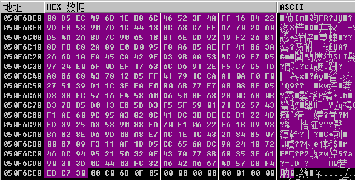
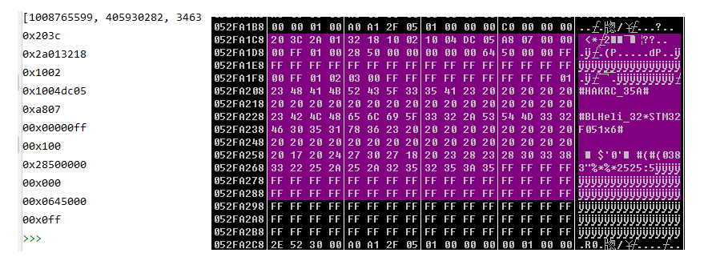
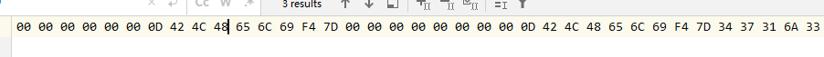
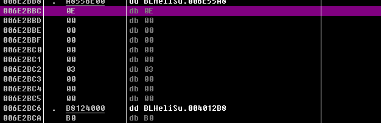
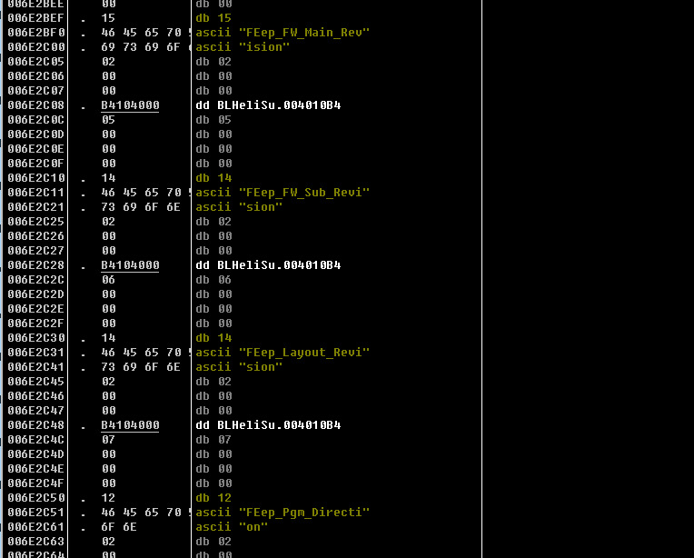
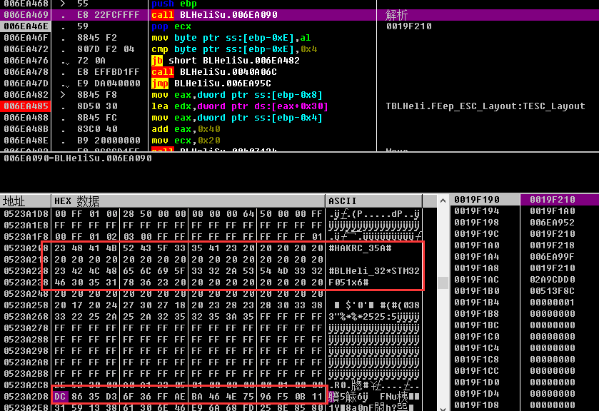
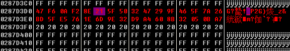
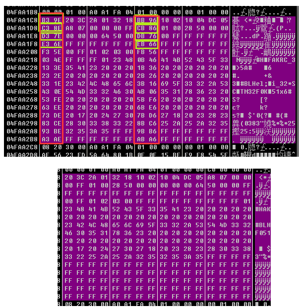
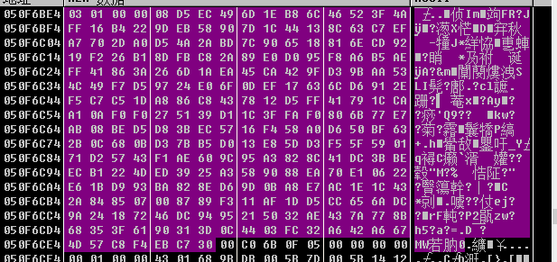
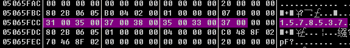

# BLHeliSuite32 Reverse Engineering, Part 2 — Finding the Decryption Routine (XTEA, First Full Break)

Source: https://elmagnifico.tech/2021/07/16/BLHeliSuite32-Reverse2/ (2021-07-16)

Direct continuation of Part 1 (`BLHeliSuite32-Reverse.en.md`), split off purely because the
original draft got too long for the author's Markdown editor (~20,000 words). **This is the
post where the 256-byte config block's decryption is actually found and broken for the first
time** — Part 4's XTEA-key-set discovery for test/beta firmware builds directly on this post's
work.

## Finding the real serial receive code: `CheckStrACK` / `RecvString`

Part 1 ended stuck looking for real UART receive code. This post finds it: the misleadingly-
named `TBootloader.CheckStrACK` is where the actual received-byte buffer lives (confirmed: its
buffer length field reads `0x0103` = 259 bytes = the 256-byte config payload + 3 protocol
overhead bytes, matching the wire capture in `BLHeli-Uart-Usb-Protocol.en.md`). The genuinely
low-level receive call is `TBootloader.RecvString`, cross-validated by the author simultaneously
sniffing the physical serial line and confirming the captured bytes match what `RecvString`
returns in the debugger — high-confidence confirmation this is the real receive path, not
another layer of indirection.



Logging strings recovered from this function confirm its purpose: `'<BOOLOADER ANSWER: '` (sic
— typo preserved from the binary) and per-interface-name-prefixed variants — this is the
bootloader response logger/parser, not a business-logic function, explaining why it was easy to
overlook by name alone.

## Locating the decrypt entry point

Picking back up in `TBLHeli.ReadSetupFromBinString`: the function branches on the received
buffer's address value against two constants, **`0xF800`** and **`0x7C00`** — the same two flash
addresses later identified in Part 4 as both being valid config-block locations depending on ESC
device type. After copying the appropriate range and a length check (`>= 0x90`), execution
reaches an unnamed call:

```asm
006EA468        push        ebp
006EA469        call        006EA090        ; <-- the key call: this is the decrypt entry point
```

Stepping into `006EA090` and following it down (`006EA090` → `006E1B48` → `006E1960` →
`006D5A78`, matching the call chain summarized identically in Part 3/4), the author observes
that immediately after this call returns, the `ESC_Layout` string (`TESC_Layout`, e.g.
`#HAKRC_35A#`) is already sitting in memory in cleartext, roughly 0xA0 bytes above the UART
buffer's own address — even though no obvious "parsing" instructions were visible on the way in.
This is the point where the author confirms decryption is actually happening (as opposed to the
data merely being reformatted), and traces the surrounding code to find the actual cipher loop.



The screenshot above shows the exact plaintext strings `#HAKRC_35A#` (ESC_Layout, offset 0x40)
and `#BLHeli_32*STM32F051x6#` (ESC_CPU/MCU identifier, offset 0x60) recovered live in the
debugger — directly corroborating the field layout documented independently in
`BLHeliSuite32-Reverse3.en.md`.

## The cipher, reverse-engineered by hand (pre-naming; confirmed as XTEA in Part 4)

The author works out the following per-4-byte-word transform purely from the disassembly,
**before** recognizing it as a named algorithm (that identification — XTEA, via the
`0x9E3779B9` magic constant — comes in Part 4):

```
Let A = one 32-bit input word.
I = ((A << 4) XOR (A >> 5)) + A

External running key B, initialized to 0xC6EF3720 (this is ebx; updated every round)
C = (B >> 11) & 0x3                     ; selects 1 of 4 key words by index
D = key_words[C]                        ; key_words = [ebp+C*4-0x34] on the stack
E = D + B
F = 0x7C00                              ; the flash target address (see Part 4: NOT a fixed
                                         ; constant — varies by device type / which block)
G = E + F
H = I XOR G

Then, each round:
J = 0x9E3779B9                          ; TEA/XTEA magic constant (identified explicitly in Part 4)
local3 -= H
B -= J

K = local3
L = ((K << 4) XOR (K >> 5)) + K
M = B & 0x3
N = key_words[M]
O = N + B + F
L = L XOR O
local4 -= L
```

`local3`/`local4` hold the running 2x32-bit Feistel state for one 8-byte block; each round
subtracts a computed value from each half in alternation — standard XTEA decrypt structure
(32 rounds per block, confirmed against the round-count constant `0x20` read from a fixed
address in the binary). Once 256 bytes (32 blocks of 8 bytes) are fully processed, **the first 2
bytes of every 8-byte decrypted block are discarded**, and the remaining 6 bytes of each block
are concatenated to form the final readable configuration buffer — **256 encrypted bytes yield
192 bytes of usable plaintext** (32 blocks × 6 kept bytes), matching the `0xC0` (192-byte)
buffer length pushed in `WriteSetupToString` documented in `BLHeliSuite32-Reverse3.en.md`.

### Standalone Python re-implementation (author's own working decrypt script)

Faithfully reproduced from the source (Python 3; needs a real `rawdata.txt` hex capture of a
`03 00 00 F0 ...` read-256-bytes response, same capture format as
`BLHeli-Uart-Usb-Protocol.en.md`'s raw traffic dumps):

```python
import os
import sys

ds = {}
ds[0x839634] = 0x9E3779B9
ds[0x839630] = 0x20
local1 = 0x19F164
mem = {}
mem[local1] = 0x19F20C
mem[0x19F140] = 0x318234B4   # key word 0 -- must-have, production-firmware value
mem[0x19F13C] = 0x29A1FA54   # key word 1 (indexed via [ebp+edx*4-0x34])
mem[0x19F138] = 0x9E81C901   # key word 2
mem[0x19F134] = 0x81FBC617   # key word 3
mem[0x19F168 - 6] = 0x7C00   # per-block address/tweak value; incremented by 8 each block
mem[0x19F20C] = 0x4FEA1C8
ebp = 0x19F168

uart_buff = []
f = open(os.path.dirname(__file__) + "/rawdata.txt")
hex_data = f.read()
start = None
state = 0
for i in range(0, len(hex_data), 3):
    if (hex_data[i] + hex_data[i + 1]) == "03" and state == 0:
        state = 1
    elif (hex_data[i] + hex_data[i + 1]) == "00" and state == 1:
        state = 2
    elif (hex_data[i] + hex_data[i + 1]) == "00" and state == 2:
        state = 3
    elif (hex_data[i] + hex_data[i + 1]) == "F0" and state == 3:
        state = 4
        start = i + 3
        break
    else:
        state = 0
if start is None:
    sys.exit(0)

for i in range(start, start + 256 * 3, 3):
    uart_buff.append("" + hex_data[i] + hex_data[i + 1])
f.close()

decrypt_mem = []
for blk in range(0, 0x100, 8):
    mem[0x19F158] = int(uart_buff[blk+3] + uart_buff[blk+2] + uart_buff[blk+1] + uart_buff[blk+0], base=16)
    mem[0x19F15C] = int(uart_buff[blk+7] + uart_buff[blk+6] + uart_buff[blk+5] + uart_buff[blk+4], base=16)
    ebx = (ds[0x839634] * ds[0x839630]) & 0xFFFFFFFF

    for _ in range(32):
        esi = mem[0x19F158]
        eax = ((esi << 4) ^ (esi >> 5)) & 0xFFFFFFFF
        eax = (eax + esi) & 0xFFFFFFFF
        edx = (ebx >> 0xB) & 0x3
        edx = mem[ebp + edx * 4 - 0x34]
        edx = (edx + ebx) & 0xFFFFFFFF
        ecx = mem[ebp - 0x6]
        edx = (edx + ecx) & 0xFFFFFFFF
        eax ^= edx
        mem[0x19F15C] = (mem[0x19F15C] - eax) & 0xFFFFFFFF
        ebx = (ebx - ds[0x839634]) & 0xFFFFFFFF

        edi = mem[0x19F15C]
        eax = ((edi << 4) ^ (edi >> 5)) & 0xFFFFFFFF
        eax = (eax + edi) & 0xFFFFFFFF
        edx = 0x3 & ebx
        edx = mem[ebp + edx * 4 - 0x34]
        edx = (edx + ebx) & 0xFFFFFFFF
        ecx = mem[ebp - 0x6]
        edx = (edx + ecx) & 0xFFFFFFFF
        eax ^= edx
        mem[0x19F158] = (mem[0x19F158] - eax) & 0xFFFFFFFF

    mem[0x19F168 - 6] += 8      # per-block address/tweak advances by 8 every block
    decrypt_mem.append(mem[0x19F158])
    decrypt_mem.append(mem[0x19F15C])

def byte2hex(data):
    return "0x" + ('%02X' % data)

for i in range(0, 64, 2):
    # discard the low 16 bits of decrypt_mem[i+0] -- these 2 bytes are NOT part of the config
    pd  = byte2hex((decrypt_mem[i+0] & 0x00FF0000) >> 16) + " "
    pd += byte2hex((decrypt_mem[i+0] & 0xFF000000) >> 24) + " "
    pd += byte2hex((decrypt_mem[i+1] & 0x000000FF) >> 0)  + " "
    pd += byte2hex((decrypt_mem[i+1] & 0x0000FF00) >> 8)  + " "
    pd += byte2hex((decrypt_mem[i+1] & 0x00FF0000) >> 16) + " "
    pd += byte2hex((decrypt_mem[i+1] & 0xFF000000) >> 24)
    print(pd)
```



Validated: output matches the disassembler-observed plaintext byte-for-byte, and successfully
recovers the full ESC name/layout/CPU/settings strings for the author's test ESC.

### LICENSING/ACTIVATION RELEVANT — likely explanation for why identical config re-encrypts differently every read

The wire-capture post (`BLHeli-Uart-Usb-Protocol.en.md`) observed that reading the *same*
unchanged configuration from the same ESC produces a **completely different 256-byte ciphertext
on every single read**, and `BLHeliSuite32-Reverse4.en.md` flagged this as an unresolved open
question given a purely static-key XTEA decrypt. **This post's decrypt process itself supplies
the likely answer**: each 8-byte encrypted block decodes to only **6 usable plaintext bytes** —
the leading 2 bytes of every decrypted block are discarded and never appear in the final
configuration. The author explicitly speculates (Summary section, own words): *"至于为什么每次
加密后的密文都不同，那就不知道了，难道是每次随机给进来的前2个字节是随机的？"* — "as for why the
ciphertext differs every time, unclear — could the first 2 bytes fed in each time be random?"
**This means the natural design is for the ESC's encrypt side to fill those 2 always-discarded
bytes per block with fresh random/counter data on every write of the ciphertext to the wire**
(a per-block nonce that never needs to round-trip since the host throws it away), which would
fully explain the observed per-read ciphertext variability while still using a static, config-
content-independent 128-bit key. The author did not pursue confirming this (no need for their
own use case, since they only needed to decrypt, not re-encrypt) — **this project should verify
it directly**: decrypt two back-to-back raw captures of an unchanged configuration with this
project's own XTEA implementation, and diff the *discarded* 2-byte-per-block values across the
two captures. If those discarded bytes differ while the kept 6-byte-per-block plaintext is
identical, the nonce theory is confirmed, and a from-scratch **encrypter** (needed for a MITM
proxy that must transparently re-encrypt injected/modified configuration data back onto the
wire) can simply fill those 2 bytes with arbitrary/random values per block without needing to
determine their real semantics.

## Variable/memory map notes (author's own reference table, useful for re-deriving offsets against a different binary build)

```
TBLHeli object base example address: 0x287D380
  +0xB4  MCU_DeviceID       : Integer
  +0xD2  MCU_Manufacturer
  +0xD1  Is_64K             : Boolean
  +0x18  MCU                : string (likely a display name)

UART receive buffer base example address: 0x4FEA1C8 (or 0x52FA2D8 in another capture)
  first 4 bytes: length header, e.g. 00 01 00 00 -> 256 (0x100) bytes follow
```

These are process-specific addresses that will differ on any other run/build — useful only as a
map of *which offsets to look for*, not as fixed constants.

## Full call flow (identical structure to the one independently reconstructed in Part 3/4)

```
actReadSetupExecute
 DoBtnReadSetup
  ReadSetupAll
   ReadDeviceSetupSection
    Send_cmd_DeviceReadBLHeliSetupSection   -- wire read, 256+3 bytes via RecvString/CheckStrACK
    ReadSetupFromBinString                  -- decrypt + parse
     TBLHeli.Init
     BLHeliSu.006EA090   -- decrypt entry
      BLHeliSu.006E1B48  -- decrypt loop (XTEA rounds, per 8-byte block)
       BLHeliSu.006E1960 -- memory-readable-region check
        BLHeliSu.006D5A78 -- offset/indexing helper
    ReadDeviceActivationStatus   -- second read, content not analyzed in this post
    ReadDeviceUUID_Str           -- third read, content not analyzed in this post
   CopyTo
   SetupToControls
```















## Key material found in this post (production firmware)

```
K0 = 0x318234B4
K1 = 0x29A1FA54   (indexed via [ebp+edx*4-0x34])
K2 = 0x9E81C901
K3 = 0x81FBC617
```

Identical to the "production firmware key" values later confirmed and contrasted against the
test/beta-firmware key set in `BLHeliSuite32-Reverse4.en.md` — this post is the origin of that
key material, found first empirically via disassembly before its cipher family (XTEA) was
identified by name.

## Relevance to this project

This is the origin post for the entire config-block-decryption capability documented across the
series: the actual working (if not yet named) decrypt algorithm, the first working standalone
Python re-implementation, the discovery that only 6 of every 8 decrypted bytes are kept
(192 usable bytes total), and a strong, this-project-should-verify lead on why per-read
ciphertext varies for unchanged configuration (likely a discarded random nonce in the 2 bytes
dropped per block) — directly actionable for building this project's own encrypt/decrypt module
and for designing a MITM proxy capable of transparently rewriting configuration in transit.
