# BLHeliSuite32 Reverse Engineering, Part 3 — Decoding the Decrypted Config Block

Source: https://elmagnifico.tech/2021/07/20/BLHeliSuite32-Reverse3/ (2021-07-20)

Continues directly from Part 2 (decryption of the 256-byte config blob). This post is a
disassembly walkthrough of `TBLHeli.ReadSetupFromBinString` — the routine that takes the
**already-decrypted** 256-byte buffer and unpacks it into named fields — plus the mirror-image
write path `TBLHeli.SetParameterValue`. Tool: OllyDbg (`OD`) against the Delphi
`BLHeliSuite32` binary, referencing internal symbol names recovered from debug info
(`TBLHeli.FEep_*` etc.).

## Decrypted 256-byte configuration layout (fully mapped)

This is the actual plaintext structure of the block read from ESC flash address `0x7C00` (see
`BLHeli-Uart-Usb-Protocol.en.md` for the wire-level read of this same block, still encrypted at
that layer):

| Offset | Size | Field name | Example value | Meaning |
|---|---|---|---|---|
| 0x0 | 1 | FW_Main_Revision | 0x20 (32) | BLHeli firmware rev, integer part |
| 0x1 | 1 | FW_Sub_Revision | 0x3C (60→displayed ".6") | BLHeli firmware rev, fractional part, trailing 0 stripped |
| 0x2 | 1 | Layout_Revision | 0x2A | Internal layout/build identifier, not shown directly in UI |
| 0x3 | 1 | Pgm_Direction | 0x01 | Motor Direction |
| 0x4 | 1 | Pgm_Rampup_Pwr | 0x32 | Rampup Power |
| 0x5 | 1 | Pgm_Pwm_Frequency | 0x18 | PWM Frequency |
| 0x6 | 1 | Pgm_Comm_Timing | 0x10 | Motor Timing |
| 0x7 | 1 | Pgm_Demag_Comp | 0x02 | Demag Compensation |
| 0x8 | 2 | Pgm_Min_Throttle | 0x0410 | Minimum Throttle |
| 0xA | 2 | Pgm_Center_Throttle | 0x05DC | (labeled Throttle Cal Enable in UI, but stores center value) |
| 0xC | 2 | Pgm_Max_Throttle | 0x07A8 | Maximum Throttle |
| 0xE | 1 | Pgm_Enable_Throttle_Cal | 0x0 | Throttle Cal Enable |
| 0xF | 1 | Pgm_Temp_Prot | 0x0 | Temperature Protection |
| 0x10 | 1 | Pgm_Volt_Prot | 0x0 | Low Voltage Protection |
| 0x11 | 1 | Pgm_Curr_Prot | 0x0 | unused/no live UI mapping found |
| 0x12 | 1 | Pgm_Enable_Power_Prot | 0x1 | Low RPM Power Protect |
| 0x13 | 1 | Pgm_Brake_On_Stop | 0x0 | Brake On Stop |
| 0x14 | 1 | Pgm_Beep_Strength | 0x28 | Startup Beep Volume |
| 0x15 | 1 | Pgm_Beacon_Strength | 0x50 | Beacon/Signal Volume |
| 0x16 | 2 | Pgm_Beacon_Delay | 0x0000 | Beacon Delay |
| 0x18 | 1 | Pgm_LED_Control | 0x0 | LED Control |
| 0x19 | 1 | Pgm_Max_Acceleration | 0x0 | Maximum Acceleration |
| 0x1A | 1 | Pgm_Nondamped_Mode | 0x0 | Non Damped Mode |
| 0x1B | 1 | Pgm_Curr_Sense_Cal | 0x64 | unused/no live UI mapping found |
| 0x1C | 1 | Note_Config | 0x50 | Music Note Config (speed/interval nibbles) |
| 0x1D | 1 | Pgm_Sine_Mode | 0x0 | Sine Modulation Mode |
| 0x1E | 1 | Pgm_Auto_Tlm_Mode | 0x0 | Auto Telemetry |
| 0x1F | 1 | Pgm_Stall_Prot | 0xFF | unused/no live UI mapping found |
| 0x20 | 1 | Pgm_SBUS_Channel | 0xFF | unused/no live UI mapping found |
| 0x21 | 1 | Pgm_SPORT_Physical | 0xFF | unused/no live UI mapping found |
| 0x30 | 1 | Hw_Voltage_Sense_Capable | 0x0 | hardware capability flag |
| 0x31 | 1 | Hw_Current_Sense_Capable | 0x0 | hardware capability flag |
| 0x32-0x35 | 4 | Hw_LED_Capable_0..3 | 1,2,3,0 (0xFF=none) | which LED index exists per slot |
| 0x3F | 1 | Nondamped_Capable | 0x01 | hardware capability flag |
| 0x40 | 32 | ESC_Layout | e.g. `#HAKRC_35A#` | ASCII ESC hardware/layout identifier string |
| 0x60 | 16-32 | ESC_CPU / ESC_MCU | e.g. `i_32*STM32F051X6` | **ASCII MCU/silicon identifier string — noted by the author as apparently used for some form of detection/verification, though not traced further in this post** |
| 0x80 | 16 | ESC_Name | user-set string | ESC display name |
| 0x90 | 48 | Note_Array | byte sequence, unused slots = 0xFF | startup-tune note data |

Note: two numbering passes appear in the post — an earlier pass documents offsets relative to
the *live in-memory* `TBLHeli` object layout (0x3.. for `Pgm_Direction` etc., matching the read
side, `ReadSetupFromBinString`/`SetParameterValue`), while the final table above documents
offsets **within the raw decrypted 256-byte wire block itself** (0x0-0x21 core params, 0x30+
hardware/layout/name/music) — the two numbering schemes differ by a small in-memory header
offset; use the final table for wire-format work.

### LICENSING/ACTIVATION RELEVANT — ESC_CPU/MCU string used "for detection"

The `ESC_CPU`/`ESC_MCU` field (offset `0x60`, ASCII, e.g. `i_32*STM32F051X6`) is explicitly
flagged by the author as *"这个值好像会被用来检测"* — "this value seems to be used for some
kind of check/detection" — without further tracing in this post. Given the corpus-wide pattern
of UUID/CPU-model-based activation (see `BLHeli-END.en.md`'s manufacturer activator flow), this
string is a strong candidate for part of the server-side activation/validation key material or
hardware-fingerprint check, and should be a priority target if this project pursues deeper
disassembly of the activation path specifically.

### LICENSING/ACTIVATION RELEVANT — activation/UUID reads exist but are explicitly out of scope here

The full call-flow trace at the end of the post (see below) shows the configurator performs
**two additional reads right after the config read**, named directly in the recovered symbols:

- `ReadDeviceActivationStatus` — second read (this is almost certainly the wire-level read of
  address `0xEB00` documented in `BLHeli-Uart-Usb-Protocol.en.md`, whose purpose that post
  could not identify — this post's call-flow trace now gives it a name and confirms it is
  license/activation-status data, though the author explicitly did not decode its content here:
  *"由于和电调配置无关,具体数据没解析"* — "unrelated to ESC configuration, content not
  analyzed").
- `ReadDeviceUUID_Str` — third read (correspondingly, this is almost certainly wire address
  `0xF7AC`, the block that read back bit-for-bit identical every time in the protocol post —
  consistent with a fixed per-chip UUID string rather than mutable configuration).

**This is the single most actionable lead in this post for the project's actual goal**: the
activation-status and UUID reads are wire-protocol-visible, named, and now positively linked to
specific fixed addresses from the protocol-capture post — but their *payload format* is still
undecoded. A follow-up disassembly pass targeting `ReadDeviceActivationStatus` and
`ReadDeviceUUID_Str` specifically (rather than the config-parsing path this post covers) is the
next concrete reverse-engineering step this corpus points to.

## Key disassembly findings (config parsing, `ReadSetupFromBinString`)

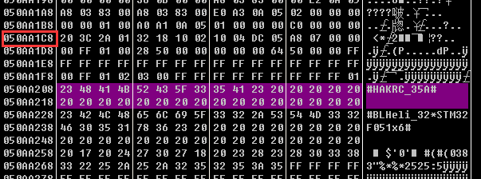

- Buffer offset `0x40`, 32 bytes → `ESC_Layout` ASCII string (example capture: `#HAKRC_35A#`).
- First decrypted byte → `FW_Main_Revision` (0x20 → displayed "32").

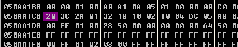

- Second byte → `FW_Sub_Revision` (0x3C → displayed ".6", i.e. combined "32.6"; the UI strips a
  trailing zero from the raw sub-revision value).
- Third byte → `Layout_Revision` (example: 0x2A).

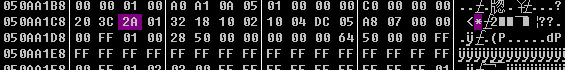

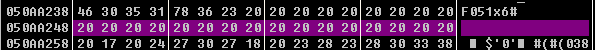

- Offset `0x80`, 16 bytes → `ESC_Name` (example capture: unset, all spaces).
- Offsets `0x32-0x35` → 4 bytes of LED-capability/index flags (0xFF = LED slot absent).

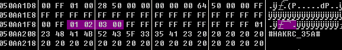

- Offset `0x1C` (`Note_Config`) + offset `0x90`, 48 bytes (`Note_Array`) → startup-tune
  configuration; unused note slots are padded with `0xFF`.

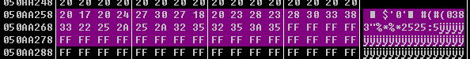

- A separate PWM min/center/max field exists in the decrypted buffer (author reads it directly
  as `int16` — 1040 / 1500 / 1960 — matching real throttle range) **but no code path was found
  that actually reads or applies it** — possibly dead/legacy data retained in the format.

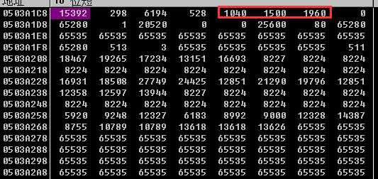

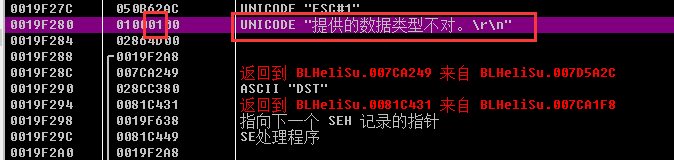

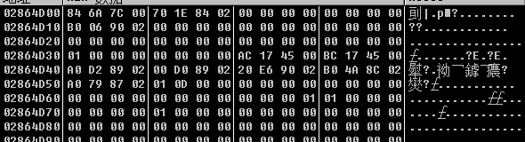

## `BLHeliStored` / `CopyTo` / `WriteSetupToString` (display-path tracing)

- `SetupToControls` itself is a thin dispatch through a function-pointer field
  (`FOnSetupToControls`) — the actual UI update logic lives elsewhere (likely delegate-style
  cross-thread callback); not fully traced.
- `BLHeliStored` indexes an array by `FCurrentESCNum` (`eax+edx*4+0x174`) — i.e. each connected
  ESC gets its own 4-byte-stride slot in a per-ESC-object array, confirming the tool's
  multi-ESC (4way-if) support is just N parallel copies of the same `TBLHeli` object structure.

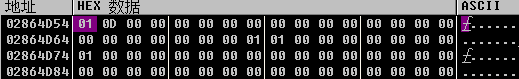

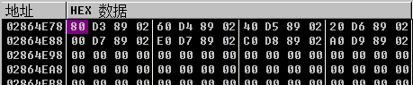

- `CopyTo` is called whenever the UI switches between the **Setup** and **Overview** tabs; the
  author confirms both tabs render from identical underlying data — Setup allows editing,
  Overview is read-only.

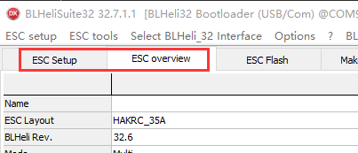

- Inside `CopyTo`: calls `WriteSetupToString` (serializes live `TBLHeli` object fields back into
  a byte buffer format — used for the Overview display) then `ReadSetupFromBinString` again
  (re-parses that buffer) — effectively a round-trip re-normalization, not a fresh decrypt.
- `CopyTo` also conditionally copies `FActivationStatus`, `FDshotGoodFrames`, `FDshotBadFrames`,
  and `FInputProtocol` fields when a specific flag bit is set — **`FActivationStatus` is a named
  in-memory field holding the ESC's activation state**, confirming the configurator keeps
  activation status as first-class object state alongside configuration, not as a one-off
  ephemeral value.

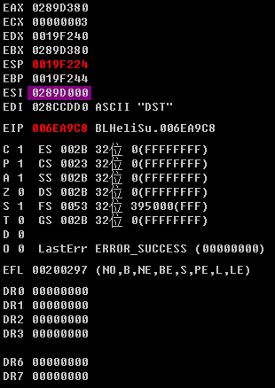

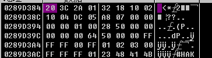

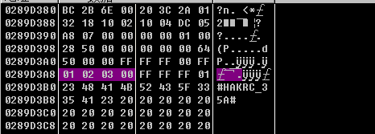

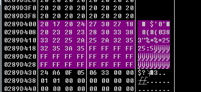

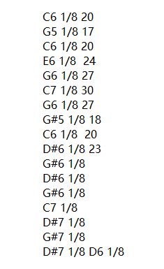

## SetParameterValue (write path) — full field-by-field jump table

The write path (`TBLHeli.SetParameterValue`) is a 0x2A-entry jump table keyed by a parameter-ID
byte (`bl`, 0-0x29), writing either 1 or 2 bytes into the live object at a fixed per-parameter
offset. This is functionally the mirror of `ReadSetupFromBinString`'s parsing and gives a full,
independently-confirmed list of every settable field and its live-object offset — see the raw
Chinese source (`notes/BLHeliSuite32-Reverse3.zh.md`, section `SetParameterValue`, lines
~443-648) for the complete disassembly if exact live-object offsets (as opposed to wire-block
offsets) are needed for a from-scratch client implementation.

Fields confirmed to require special-case handling on write (not simple pass-through):
- `Pgm_Brake_On_Stop` — clamped to `GetParameterMax` if the ESC is programmable-brake-capable
  and the requested value is nonzero-but-out-of-range.
- Parameter index `0x0F` (`Pgm_Curr_Prot`/current-protection-adjacent) — has special-cased
  "falsely hard-enabled" override logic (`IsCurrentProtectionFalselyHardEnabled`) that can force
  a value to its default regardless of what was requested.
- Any parameter failing `IsParameterValid` or out of `GetParameterMin`/`GetParameterMax` range
  falls back to `SetParameterValueToDefault` rather than being written as-given — i.e. the
  configurator silently clamps/defaults invalid values rather than rejecting them.

## Full call flow (author's own summary, verbatim structure)

```
actReadSetupExecute (button handler)
 DoBtnReadSetup
  ReadSetupAll
   ReadDeviceSetupSection
    Send_cmd_DeviceReadBLHeliSetupSection   -- wire read, yields the 256-byte block
    ReadSetupFromBinString                  -- decrypt + parse into TBLHeli fields
     TBLHeli.Init
     <decrypt entry>
      <decrypt loop>
       <memory-readable-region check>
        <offset/index helper>
    ReadDeviceActivationStatus              -- second wire read; content NOT decoded here
    ReadDeviceUUID_Str                      -- third wire read; content NOT decoded here
   CopyTo
    WriteSetupToString
    ReadSetupFromBinString                  -- re-parse, for Overview-tab display
   SetupToControls
    OnSetupToControls                       -- UI refresh callback
```

## Author's retrospective notes (methodology, not technical)

- No prior x86 assembly experience going in; ~10 days total, with the first ~5 days stuck with
  minimal progress before finding the actual decrypt entry point (initially skipped over
  unnamed/stripped functions, assuming they were unimportant — they weren't).
- Recommends importing IDA/IDR symbol recovery into OllyDbg directly next time, to avoid
  re-deriving names already available from static analysis.

## Relevance to this project

This post gives the **complete plaintext configuration schema** for the BLHeli_32 256-byte
config block (usable directly for reading/writing ESC settings once the encryption from Part 2
is applied/reversed), and — most importantly for the licensing goal — **positively identifies
and locates** (though does not decode) the two additional protocol reads that carry activation
status and per-chip UUID data. Those two reads are the next disassembly target for anyone
pursuing the actual license/activation bypass rather than just configuration passthrough.
