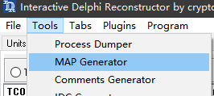
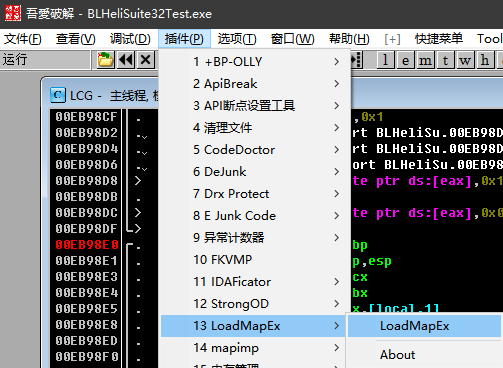
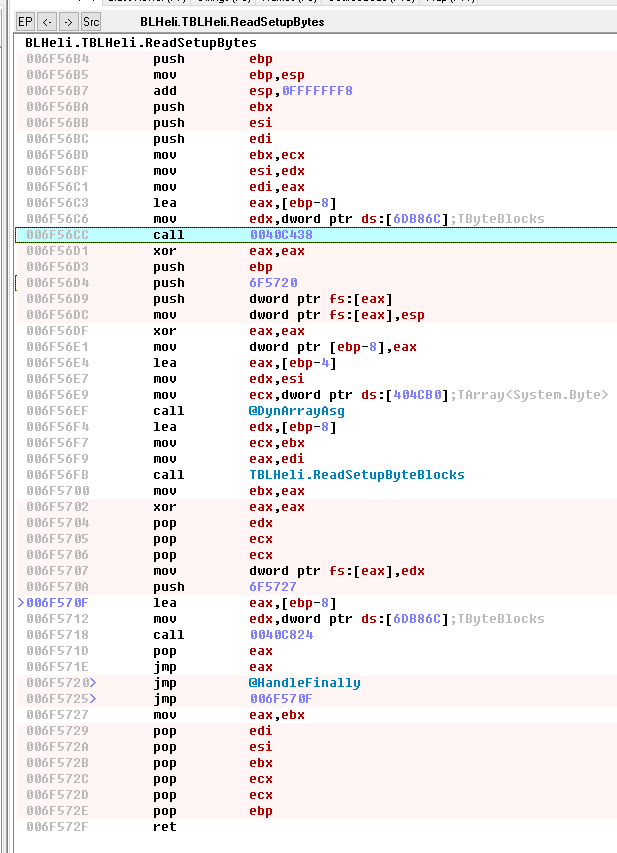

# BLHeliSuite32 Reverse Engineering, Part 5 (English technical notes)

Source: https://elmagnifico.tech/2024/06/17/BLHeliSuite32-Reverse5/ (2024-06-17)
Tagged "Crack", not "BLHeli" — **easy to miss when crawling by tag**, published ~2 weeks after the
BLHeli-END shutdown post. Context: after BLHeli's server went offline, the vendor handed
manufacturers an "offline" build of the configurator; this offline build turned out to be
incompatible with the previous reverse-engineering notes (parts 1-4), so the author re-did the
static/dynamic analysis against the new binary to find what changed.

## Method note: IDA (IDR) + OllyDbg map mismatch

Author first tried generating an address map from IDA ("IDR") and loading it into OllyDbg as
before. The map didn't line up — addresses appeared shifted/misaligned even after loading —
prompting a suspicion of "some new protection mechanism." (Resolved later, see Summary: it was
just a recompiled binary with shifted offsets, not new anti-analysis protection.)




## New call path (function names changed vs. parts 1-4)

```
actReadSetupExecute (button action)
 DoBtnReadSetup
  _DoBtnReadSetup
   ReadSetupCurrentESC
    DoConnectInterface
    TBLHeli.Init
    ReadDeviceSetupSection
     ReadSetupByteBlocks
     ReadSetupBytes
```

`ReadDeviceSetupSection` now calls **two** distinct read paths — `ReadSetupByteBlocks` and
`ReadSetupBytes` — both of which route through the same low-level helper at `0x0040C438`
(suspected shared decrypt/array-processing routine, structurally similar to Delphi dynamic-array
handling — the post treats it as "probably crypto-related" without fully resolving it).



### `ReadSetupByteBlocks` — two memory-region constants

Inside `ReadSetupByteBlocks` the code branches on buffer-length thresholds against two literal
constants: `0xF800` and `0x7C00`. The post flags these explicitly as **"register/address values
that are also part of the key computation"** (关键地址...也是密钥计算中的一环) — i.e. these two
offsets aren't just buffer-size branches, they feed into whatever the decryption key derivation
does downstream (in `0006F578C`/`0x006ECD68`). Both appear again as the `cx` (region-select)
parameter passed to a shared low-level decrypt call `0x006ECD68` inside the newly-found
`0x006F578C` routine, called with all 4 combinations of two boolean flags — strongly suggesting a
2-bit selector (region × mode) choosing among up to 4 key/data variants per read.

### `0x006ECD68` — restructured decrypt/array routine

This is the post-update replacement for the old decrypt entry point. The author explicitly notes
the internal structure changed substantially from the version in parts 1-2/3, so old traced
addresses inside the decryption loop don't carry over to this build — any BLHeli32Proxy
implementation must re-locate this per configurator binary version rather than hardcoding offsets.

## Field offset table — drifted vs. part 3 (same build family, recompiled)

`TBLHeli` object field offsets differ from the part-3 table (different compiler layout, but same
logical fields plus one new one). Confirmed via the same debugger cross-reference technique:

| Field | Part 3 offset | Part 5 offset | Notes |
|---|---|---|---|
| `FW_Main_Revision` | +4 | +4 | unchanged |
| `FW_Sub_Revision` | +5 | +5 | unchanged |
| `Layout_Revision` | +6 | +6 | unchanged |
| `ESC_Layout` (32B) | +0x30 | +0x33 | shifted +3 |
| `ESC_Layout_Org_Str` | +0xB0 | +0xB4 | shifted +4 |
| `IsAlternateSettingsKey` (bool) | +0xBA | +0xBC | shifted +2 |
| `ESC_Name` (16B) | +0x70 | +0x73 | shifted +3 |
| `Hw_LED_Capable_0..3` | +0x28..+0x2B | +0x2B..+0x2E | shifted +3 |
| `Hw_Voltage_Sense_Capable` | +0x26 | +0x29 | shifted +3 |
| `Hw_Current_Sense_Capable` | +0x27 | +0x2A | shifted +3 |
| `Nondamped_Capable` | +0x2F | +0x32 | shifted +3 |
| `Note_Config` | +0x20 | +0x20 | unchanged |
| `Note_Array` (48B) | +0x80 | +0x83 | shifted +3 |
| `Hw_Pwm_Freq_Min/Max` | +0x2C/+0x2D | +0x2F/+0x30 | shifted +3 |
| `SPORT_Capable` | +0x2E | +0x31 | shifted +3 |
| `FlashCounter` (byte) | *(not present)* | +0x28 | **new field** |
| `FStatus : TSetupStatus` | +0xC0 | +0xC4 | shifted +4 |

### LICENSING/ACTIVATION RELEVANT

- **`FlashCounter`** is a field that did not exist in the part-3 (pre-shutdown) build and appears
  newly added at object offset `+0x28` in this post-shutdown "offline" build, populated straight
  from the decrypted wire buffer (`ebx+0x2F`). A byte-wide per-ESC flash/write counter appearing
  specifically in the version shipped after the license server went offline is a strong candidate
  for local flash-count tracking that used to be validated server-side.
- Decrypted-buffer field layout, PWM-frequency gating, and the `IsParameterValid` /
  `SetParameterValueOrDefault` dispatch loop are otherwise structurally identical to part 3 (same
  256-byte format, same parameter table, just recompiled with different field offsets) — the wire
  protocol itself did not change.
- **Author's closing statement (translated):** *"Turned out to be a false alarm — the [decryption]
  key for the test-firmware build is the same as before; it's just that BLHeliSuite32's code was
  rebuilt, so some function addresses shifted. Through this reverse-engineering pass I did in fact
  see, again, some content that previously required online verification, and the old
  activation-key entry UI."* This directly confirms: (1) an activation-key entry UI exists in the
  configurator, (2) some code paths gate on "requires online verification," and (3) the underlying
  crypto key BLHeliSuite32 uses to decrypt the 256-byte ESC setup block is unaffected by
  activation/online-verification state — the encryption is a transport-obfuscation layer, not
  itself the license gate. The license gate is a separate check (activation-key UI /
  online-verification code path), not yet pinned to a specific address in this post.

## Tooling

OllyDbg (dynamic), IDA ("IDR", for generating an address map — abandoned after map/address
mismatch against the recompiled binary; the mismatch was later attributed to the recompile itself,
not an anti-debug measure).
