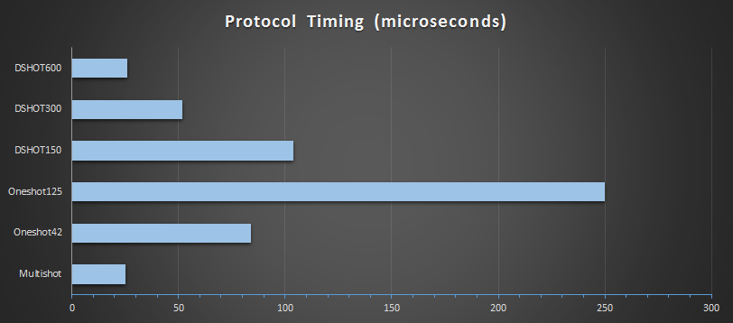
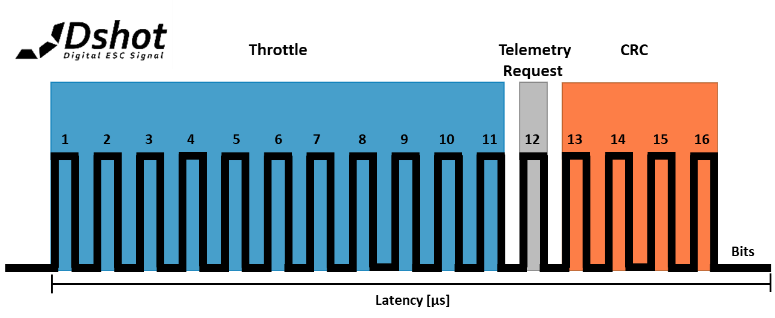
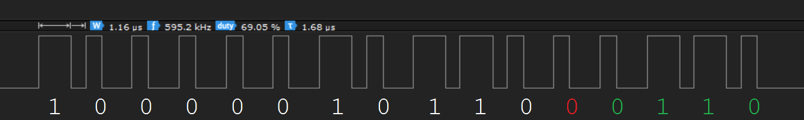
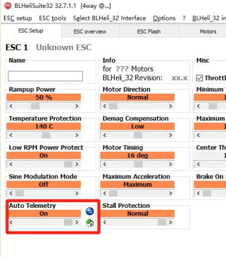
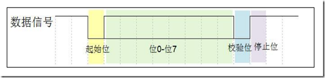
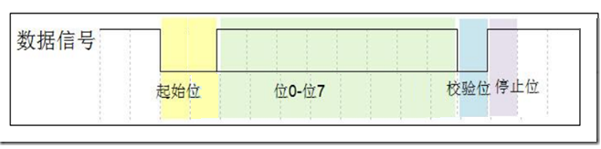

# DSHOT Guide — Protocol Basics + STM32 HAL PWM/DMA Pitfalls

Source: https://elmagnifico.tech/2020/06/03/Dshot-STM32-PWM-HAL/ (2020-06-03)

Earlier/simpler companion to `bi-directional-DSHOT.en.md` (2023) — this post covers plain
(unidirectional) DSHOT fundamentals plus STM32 `HAL` library DMA-PWM implementation bugs the
author hit building their own DSHOT driver. Background/protocol reference; not
license/activation-related, but contains the **full DSHOT command-number table**, which is
directly useful for understanding how a host can drive an ESC into config/telemetry states over
the DSHOT line itself (as opposed to the separate UART configuration protocol).

## DSHOT background

- Evolved from plain PWM (frequency-limited, e.g. 50 Hz) through Oneshot/Multishot to
  DSHOT150/300/600, now DSHOT1200 — each generation needed correspondingly faster ESC MCUs (8-bit
  → 16-bit → 32-bit) and higher clock speeds (8 MHz → 48/72+ MHz).



- DSHOT treats throttle as a **digital**, checksummed value rather than an analog pulse-width —
  in principle removing the need to recalibrate throttle endpoints per ESC (though the post
  notes BLHeli still does its own throttle calibration internally regardless).
- Benefits: interference-resistant, no per-ESC calibration required, instant direction reversal,
  telemetry feedback, fast response/low latency.
- Costs: higher demand on the flight controller MCU, sometimes an extra wire, higher ESC cost
  (needs current-sense-capable silicon for full feature support).
- Originated with KISS FC's ESC developers; BLHeli's wide adoption made it the de facto standard
  once BLHeli_32 ESCs picked it up. KISS later added private/proprietary DSHOT commands that
  BLHeli did not adopt — Betaflight's source distinguishes the two command sets.

## Frame format (plain/unidirectional DSHOT)

16-bit frame: `[11-bit throttle/command][1-bit telemetry-request][4-bit CRC]`.

| Field | Bits | Range |
|---|---|---|
| Throttle/command | 11 | 0-2047 |
| Telemetry request | 1 | 0-1 |
| CRC | 4 | 0-15 |

### Full command table (values 0-47 are reserved commands, not throttle)

| Value(s) | Meaning |
|---|---|
| 0 | Disarm/no-op (used for the arming sequence) |
| 1-5 | ESC beep, low frequency → high frequency |
| 6 | ESC info / serial number, returned via telemetry |
| 7, 8 | Motor spin direction (two opposing settings, for bidirectional-rotation setups) |
| 9, 10 | 3D mode toggle: 9 = off, 10 = on |
| **11** | **Get ESC settings** |
| **12** | **Save ESC settings** |
| 13 | Enable extended telemetry (adds temperature/voltage/current to the telemetry stream) |
| 14 | Disable extended telemetry |
| 20, 21 | Also toggle spin direction — the post notes it's unclear how these differ from 7/8 |
| 22-29 | Control 3 onboard LEDs, on/off combinations |
| 30 | Audio-stream toggle (KISS ESCs only) |
| 31 | Silent-mode toggle (KISS ESCs only) |
| 48-2047 | Real throttle value, linearly mapped to 0-1999 (2000 steps of resolution) |

### LICENSING/ACTIVATION RELEVANT — commands 11/12 are a DSHOT-level config channel

Commands **11 (Get ESC settings)** and **12 (Save ESC settings)** are a second, DSHOT-native
channel for reading/writing ESC configuration, distinct from the dedicated UART protocol in
`BLHeli-Uart-Usb-Protocol.en.md`. Neither this post nor others in the corpus trace what these
two DSHOT command values actually transfer or how they relate to the 256-byte encrypted config
block — but this is a second potential interception point for a MITM/proxy tool if a target
setup drives configuration through DSHOT-command signaling rather than (or in addition to) the
dedicated UART link. Worth empirical investigation (capture a DSHOT-based "read settings" flow
from a flight controller and see whether it correlates with the UART protocol's 3-address read
sequence) before assuming the UART protocol is the only path that needs interception.

## Bit timing table

| Mode | Bitrate | Frame rate | Bit period | "1" high time | "0" high time |
|---|---|---|---|---|---|
| DSHOT150 | 150 Kbit/s | 4.05 kHz | 6.67 µs | 5.00 µs | 2.50 µs |
| DSHOT300 | 300 Kbit/s | 8.09 kHz | 3.33 µs | 2.50 µs | 1.25 µs |
| DSHOT600 | 600 Kbit/s | 16.0 kHz | 1.67 µs | 1.25 µs | 0.625 µs |
| DSHOT1200 | 1200 Kbit/s | 32.0 kHz | 0.83 µs | 0.625 µs | 0.313 µs |

- Bit values are duty-cycle-encoded: **~75% duty = 1, ~37.5% duty = 0** — tolerance is loose,
  minor deviation from these exact ratios still decodes correctly in practice.






- Inter-frame gap: officially unspecified for DSHOT600 in most references (commonly cited as
  ~2 µs), but the author's own testing found the real requirement is **~3 bit-periods** (DSHOT1200
  may need ~4), not a fixed 2 µs — fewer than 3 bit-periods produces visible motor
  stutter/roughness at constant throttle; giving the full 3-bit-period gap fixed it. This
  reduces the effective output frequency (e.g. DSHOT600 effective ~31.5 kHz instead of the
  theoretical 37.5 kHz), confirmed working at that reduced rate.
- As of the post's 2023-04-10 update note: DSHOT is no longer strictly rate-limited by spec —
  any correctly-formed frame at effectively any rate is recognized; practical upper bound
  observed is around **DSHOT2400**.

### CRC (plain, non-bidirectional DSHOT)

```c
uint16_t add_checksum_and_telemetry(uint16_t packet) {
    uint16_t packet_telemetry = (packet << 1) | 0;   // telemetry bit, 0 here
    uint8_t i;
    int csum = 0;
    int csum_data = packet_telemetry;
    for (i = 0; i < 3; i++) {
        csum ^= csum_data;   // XOR data by nibbles
        csum_data >>= 4;
    }
    csum &= 0xf;
    packet_telemetry = (packet_telemetry << 4) | csum;
    return packet_telemetry;
}
```

Same 3-nibble-XOR construction later reused (with inversion) for bidirectional DSHOT — see
`bi-directional-DSHOT.en.md`.

## Arming sequence

DSHOT arming differs from plain PWM: the host must send **all-zero frames (command value 0, not
"zero throttle") continuously for ~3 seconds** to unlock/arm the ESC before it will accept real
throttle values. This re-arm requirement also applies whenever switching *into* DSHOT from
another protocol (e.g. PWM → DSHOT, or Oneshot → DSHOT) — it's not a one-time boot behavior.

## Telemetry (plain DSHOT, pre-bidirectional)

- Some ESCs return temperature, voltage, current, cumulative current, and RPM over a **separate
  dedicated telemetry UART output pin** (this predates/differs from the single-wire
  bidirectional-DSHOT telemetry documented in `bi-directional-DSHOT.en.md`) — still using DSHOT
  framing on that separate pin, gated by the telemetry-request bit in the outgoing frame.
- Also requires enabling telemetry response in the ESC's own configuration (i.e. a config-block
  flag, not just a protocol-level request bit).



- The post does not implement or further document the telemetry payload's exact field layout —
  refer to source (Betaflight) or `bi-directional-DSHOT.en.md` for the payload format the
  project eventually documented in more depth.

## STM32 HAL library DMA-PWM bugs encountered building a DSHOT driver

Background/tooling notes — relevant if this project ends up needing its own DSHOT
transmit/receive implementation on STM32 hardware (e.g. to simulate a flight controller or ESC
for testing), not license-relevant.

1. **Multi-channel DMA-PWM lockup**: ST's `HAL_TIM_PWM_Start_DMA` sets the timer handle state to
   `HAL_TIM_STATE_BUSY` as soon as *any* channel starts, and the DMA-complete callback
   (`TIM_DMAPeriodElapsedCplt`) is the only thing that resets it back to `READY` — meaning a
   second channel's own `Start_DMA` call gets rejected with `HAL_BUSY` while the first channel's
   transfer is still in flight, even in circular DMA mode where the "transfer" never really
   ends. **Workaround**: after calling `HAL_TIM_PWM_Start_DMA`, manually force
   `htim->State = HAL_TIM_STATE_READY` so other channels aren't blocked. Root cause is
   `HAL_TIM_PWM_Start_DMA`'s own state machine, reproduced in full in the source (see the
   Chinese note `notes/Dshot-STM32-PWM-HAL.zh.md` lines ~208-338 for the exact HAL function this
   patches).

2. **Spurious extra "0" bit on the very first DMA-PWM pulse after start**: the first time
   DMA-driven PWM is (re)started (`normal` mode: every single call; `circular` mode: only the
   very first start), the output produces **two low periods instead of one** for what should be
   a single leading `0` bit, regardless of any DMA/timer-polarity configuration tried. The
   author found no clean fix — the practical workaround is to **substitute the value used for a
   logical `0` in the very first slot with a nonzero (but still-decodes-as-0) value**, at the
   cost of a visible small glitch on the scope right before that bit; every subsequent bit and
   every non-zero first bit transmits correctly.





3. **Output→input mode switch latency**: attempting to bit-bang a single-wire UART-like protocol
   by switching the same pin between DMA-PWM output and plain GPIO input mode took **more than
   52 µs** to complete on the hardware/HAL combination tested — long enough to lose incoming
   data at 19200 baud (BLHeli's UART protocol rate, see `BLHeli-Uart-Usb-Protocol.en.md`, which
   requires ~52 µs-scale turnaround). Flagged as a structural HAL overhead problem, not something
   fixed by better configuration — a lower-level/bare-register approach may be needed for
   single-wire turnaround-sensitive protocols on this HAL version.

4. **Long-standing spurious frame-error interrupt**: DMA "frame error" completion callbacks were
   observed firing even with FIFO explicitly disabled — the author identifies this as a
   known/longstanding unfixed HAL quirk (FIFO-related interrupt enabled by default regardless of
   configuration).

Author's closing opinion: STM32 HAL trades performance/transparency for convenience; projects
like ChibiOS that redefine board resources and implement their own thinner HAL are called out as
a preferable model for this kind of timing-sensitive work.

## Relevance to this project

Background/tooling reference. The command table (specifically **DSHOT commands 11/"Get ESC
settings" and 12/"Save ESC settings"**) is the one concretely actionable lead for the project's
actual goal — a second, undocumented-in-this-corpus configuration channel alongside the UART
protocol that a complete interception layer would need to account for. The HAL DMA pitfalls are
only relevant if this project builds its own STM32-based DSHOT/UART transceiver rather than
relying on Linux-side USB-serial hardware.
