# Bidirectional DSHOT — Complete Protocol Guide

Source: https://elmagnifico.tech/2023/04/07/bi-directional-DSHOT/ (2023-04-07)

Background/on-wire protocol reference, not license/activation-related. Much of the post walks
through Betaflight's own `dshot_bitbang` driver source (public code, reproduced here only where
it clarifies protocol-level facts, not as a full driver walkthrough) plus original oscilloscope
captures and worked decode examples. Companion/predecessor post:
`Dshot-STM32-PWM-HAL.en.md` (2020, unidirectional DSHOT via STM32 PWM+DMA).

## Bidirectional DSHOT summary

- Single-wire, bidirectional (half-duplex) on the same signal line as normal DSHOT.
- Telemetry carries **only eRPM** data (a period-based encoding, see below), returned as
  eRPM/100.
- Telemetry response is **GCR(0,2)-RLL encoded**; its first transmitted bit is always driven
  low.
- The checksum nibble in the *outgoing* command frame is **bit-inverted** when bidirectional
  mode is active (vs. plain DSHOT's non-inverted checksum).
- Bidirectional DSHOT signal polarity is **inverted** relative to normal (unidirectional) DSHOT.
- DSHOT 600 and above are difficult/unreliable for bidirectional telemetry — timer sampling
  can't keep up reliably; Betaflight dropped DSHOT600 support for this reason (see "Related
  issues" below).
- Requires **BLHeli_32 firmware 32.7+**; for 8/16-bit BLHeli_S ESCs, requires **Bluejay**
  firmware (stock BLHeli_S does not support it).
- The ESC needs to have been outputting stably for a short time after power-up before it will
  reply to telemetry requests — a single isolated request right after arming typically gets no
  reply; continuous frames are needed.
- **Any bidirectional DSHOT frame always triggers a telemetry reply, regardless of whether the
  telemetry-request bit is set in that particular frame.**
- BLHeli firmware 32.92.2+ (test/beta) reportedly extends the telemetry payload to include
  temperature, voltage, and current — not just eRPM.

Reference: original Betaflight bidirectional-DSHOT implementation PR —
https://github.com/betaflight/betaflight/pull/8554

## Terminology (glossary given in the post)

- **GCR** — Group Code Recording: an encoding that expands data size but bounds run-length,
  making hardware edge-detection/timing simpler and more reliable.
- **bit-bang** — using generic GPIO (not a dedicated peripheral) to emulate a serial protocol
  (cf. software I2C/SPI).
- **3x oversampling** — decoding reliably generally needs a sampling clock ~3x the signal's own
  rate; used as the default assumption throughout.
- **5/4 (GCR expansion ratio)** — GCR encodes 4 data bits as 5 transmitted bits.
- **RLL (Run-Length-Limited)** — bounds the number of consecutive unchanged-level symbols to
  keep clock recovery reliable at low sampling rates; distinct from data-compression run-length
  encoding (RLC) despite the similar-sounding name in Chinese ("游程" vs "游程长度编码") — the
  post explicitly calls out this naming confusion.
- **eRPM** vs **RPM**: ESCs report the electrical period between magnet-pole transitions;
  motors typically have 12 or 14 magnetic poles, so eRPM must be scaled by pole count to get
  true mechanical RPM.

## Command frame format (outgoing, host → ESC)

Reference implementation, Betaflight `prepareDshotPacket`:

```c
FAST_CODE uint16_t prepareDshotPacket(dshotProtocolControl_t *pcb)
{
    uint16_t packet;
    ATOMIC_BLOCK(NVIC_PRIO_DSHOT_DMA) {
        packet = (pcb->value << 1) | (pcb->requestTelemetry ? 1 : 0);
        pcb->requestTelemetry = false;
    }
    unsigned csum = 0;
    unsigned csum_data = packet;
    for (int i = 0; i < 3; i++) {
        csum ^= csum_data;     // XOR the three 4-bit nibbles of the 12-bit value+telem-bit
        csum_data >>= 4;
    }
#ifdef USE_DSHOT_TELEMETRY
    if (useDshotTelemetry) {
        csum = ~csum;          // bidirectional mode: invert the checksum nibble
    }
#endif
    csum &= 0xf;
    packet = (packet << 4) | csum;
    return packet;
}
```

Frame layout, 16 bits total: `[11-bit throttle/command value][1-bit telemetry-request][4-bit
checksum]`. Checksum = XOR of the three 4-bit nibbles of the 12-bit `(value<<1)|telem` field;
inverted when bidirectional/telemetry mode is active. The ESC detects bidirectional mode simply
by observing that the received checksum comes out inverted from what plain-DSHOT would produce,
and switches to replying with a telemetry frame on the same wire.

### Physical bit encoding (bit-bang implementation)

Each of the 16 bits is transmitted as a 3-state "symbol": **initial-high, data-level (0 or 1),
then low**, plus one extra all-high "hold" symbol appended after the 16 data bits so the ESC can
finish sampling the last bit before the line direction potentially flips (total 51 bit-times per
frame in the referenced Betaflight bitbang driver). This makes normal-DSHOT duty cycle
66%/33% for 1/0 (vs. the more commonly cited 75%/25% for other DSHOT implementations — the post
notes this specific implementation detail differs slightly by driver).

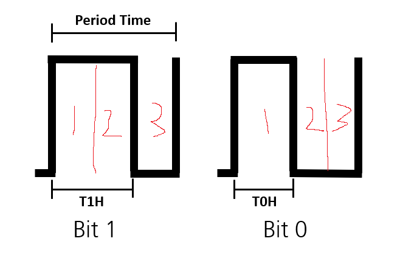

## Telemetry response frame format (ESC → host)

Raw telemetry frame is **21 bits**: a mandatory leading `0` start bit, followed by 20 bits of
GCR-encoded data (4 groups of 5 bits, each group decoding back to 4 raw bits — 20→16 bits):

```
0 aaaa bbbbb fffff ddddd     <- 21 raw transmitted bits (start bit + 4x 5-bit GCR groups)
e e e m m m m m m m m m c c c c   <- 16 bits after GCR decode
e e e m m m m m m m m m           <- 12-bit period value after checksum strip (3-bit exponent E, 9-bit mantissa M)
```

- Trailing 4 bits (`c`) are an XOR checksum over the preceding data, same style as the outgoing
  frame's checksum.
- Leading 3 bits (`e`) are a left-shift exponent; the following 9 bits (`m`) are a mantissa that
  must be left-shifted by `e` to get the actual period value — a simple floating-point-style
  encoding that lets a 12-bit field represent a much wider dynamic range than 12 bits of linear
  value would allow.
- The linear period value 0xFFF (all-ones after decode) is reserved to mean **"no rotation /
  can't measure"**, not zero — because zero would collide with a real (very fast) reading.

Reference decode (Betaflight):

```c
static uint32_t dshot_decode_eRPM_telemetry_value(uint16_t value)
{
    if (value == 0x0fff) {
        return 0;
    }
    // Convert value to 16 bit from the GCR telemetry format (eeem mmmm mmmm)
    value = (value & 0x01ff) << ((value & 0xfe00) >> 9);
    if (!value) {
        return DSHOT_TELEMETRY_INVALID;
    }
    // Convert period to erpm * 100
    return (1000000 * 60 / 100 + value / 2) / value;
}

// Used with serial esc telem as well as dshot telem
uint32_t erpmToRpm(uint16_t erpm)
{
    return (erpm * 200) / motorConfig()->motorPoleCount;
}
```

With a 12-bit period value, the effective measurable range works out to roughly 1–65408
(exact units: microsecond-scale inter-pole-transition period), giving a **minimum detectable
rotation rate of ~15.3 events/sec** — for a 14-pole motor, about 2 revolutions/sec at the low
end. The `value/2` rounding term in the final division and the exact provenance of the `*60/100`
scaling are reproduced as-is from Betaflight source; the post notes it could not fully explain
why the extra `value/2` rounding term is applied but reproduces it faithfully as the correct,
working implementation.

## GCR (0,2)-RLL encoding table (4 bits → 5 bits)

```
0000 -> 11001      0100 -> 11101      1000 -> 11010      1100 -> 11110
0001 -> 11011      0101 -> 10101      1001 -> 01001      1101 -> 01101
0010 -> 10010      0110 -> 10110      1010 -> 01010      1110 -> 01110
0011 -> 10011      0111 -> 10111      1011 -> 01011      1111 -> 01111
```

Worked example: `1011 0010` → `01011 10010`.

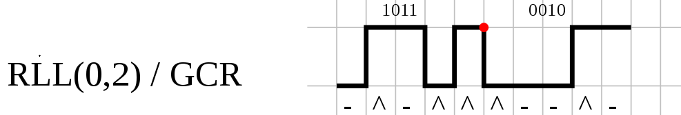

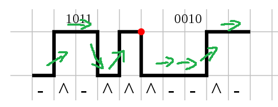

Decoding rule, once GCR framing is understood: **check for a level transition at each bit-cell
boundary — a transition means the underlying raw bit is 1, no transition means 0.** This reduces
telemetry decode to simple edge-detection once the GCR bit-cell timing is known, without needing
a lookup-table walk during real-time decode.

### FM(0,1)-RLL — contrasting encoding scheme, given for comparison

```
0 -> 10
1 -> 11
```

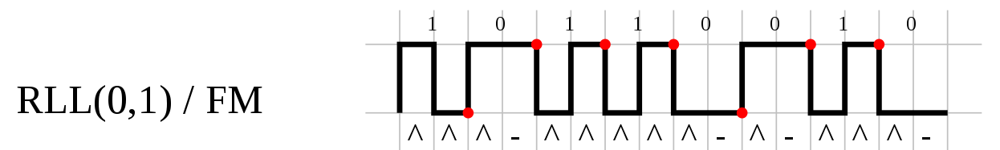

Not used by DSHOT telemetry itself — included in the post as a simpler RLL scheme to build
intuition before GCR(0,2). Historically FM's physical write frequency for a `1` was 2x that of a
`0`; the extra fixed `1` clock-bit lets both sides stay synchronized despite that asymmetry.

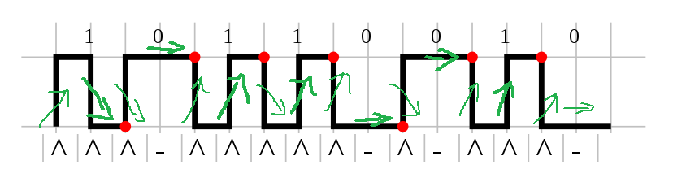

## Related upstream issues/discussion referenced

- Auto Telemetry: if an ESC has "Auto Telemetry" enabled, it will emit telemetry automatically
  even without a bidirectional-DSHOT trigger frame — a convenience for non-DSHOT host protocols.
  https://github.com/iNavFlight/inav/issues/5165

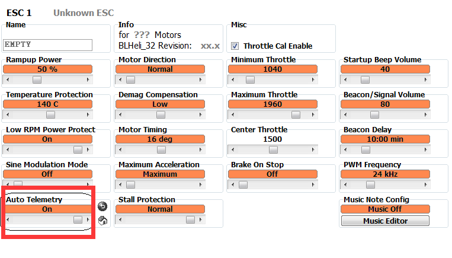

- DSHOT600 bidirectional reliability problems (short window for reliable single-wire detection)
  led Betaflight to drop DSHOT600 support entirely:
  https://github.com/bitdump/BLHeli/issues/464 ,
  https://github.com/betaflight/betaflight/issues/9886#issuecomment-655085419

## Real oscilloscope captures (author's own measurements, DSHOT300 unless noted)

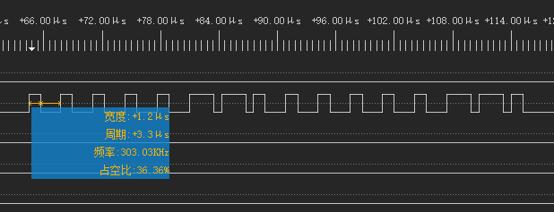

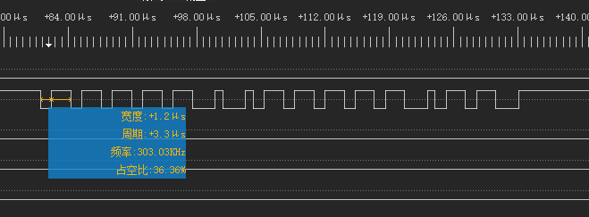

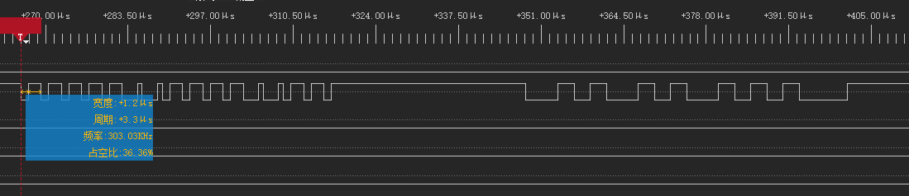

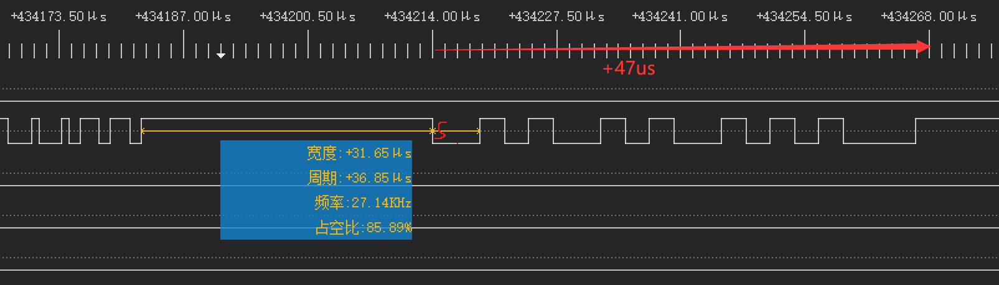

- Telemetry reply begins **~31 µs** after the end of the DSHOT command frame; the reply frame
  itself is **~47-52 µs** long (author gives both figures at different points; treat ~50 µs as
  the practical figure to budget for). Host must have already switched the line to input mode
  before the reply starts, or it is missed entirely.

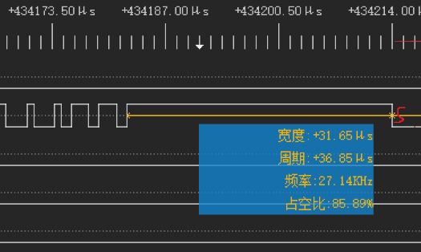

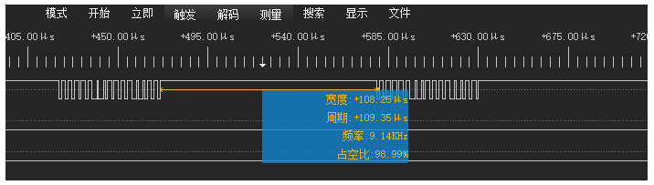

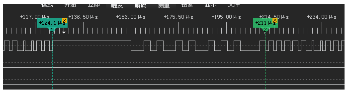

- All of the above timing figures are specific to the author's **DSHOT300** setup (bit period
  3.3 µs) — different DSHOT rates need their own timing budget, though the post notes the
  practical control-loop rate ends up ~4 kHz regardless of DSHOT300 vs DSHOT600, because the
  bottleneck is the MCU's GPIO/timer input↔output switch time, not the DSHOT bit rate itself.

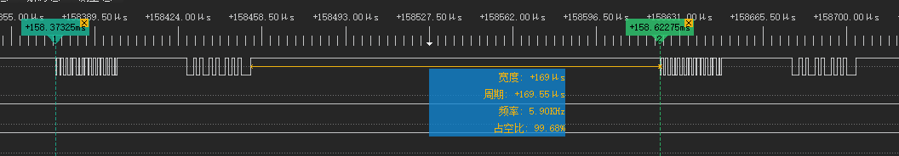

### Worked telemetry-decode example: zero-RPM case

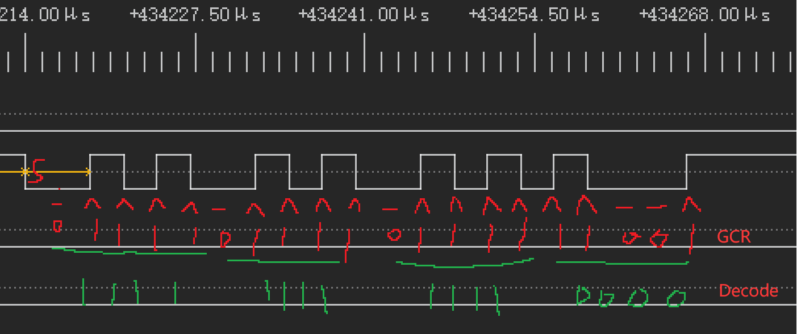

Captured while the motor was stationary (0 RPM): after stripping the mandatory leading `0` and
GCR-decoding the remaining bits (transition = 1, no transition = 0), the raw 16-bit value comes
out as `1111 1111 1111 0000`. Checksum-verifying `0xFFF0`: XOR-checksum over the top 12 bits
(`0xFFF`) yields `0xF`, matching the low nibble — checksum passes. The resulting 12-bit period
value `0x0FFF` is the reserved **"cannot measure / no rotation"** sentinel from the decode
function above, correctly yielding an RPM of 0 — consistent with the motor genuinely being
stationary at capture time.

## Implementation approach (bit-bang, from Betaflight source excerpts)

Kept brief since this reproduces public Betaflight source rather than novel reverse-engineering:
timer **Update event** (not the PWM compare channels) is used to pace a DMA transfer that reads
or writes the GPIO port's IDR/BSRR register directly, letting a single timer drive arbitrary
GPIO pins for DSHOT bit-banging without being tied to that timer's own PWM channel count/pinout.
`TIM1`/`TIM8` are used in the reference implementation for their higher channel count. Motor
vtable functions of interest: `updateStart` (drains/decodes any pending telemetry from the
*previous* cycle before starting a new transmission), `writeInt` (builds the 16-bit packet via
`prepareDshotPacket`, loads it into the DMA output buffer, inverting mid-bit levels for
telemetry mode), and a DMA completion IRQ that flips the port to input mode immediately after a
telemetry-enabled write completes, then re-arms DMA to capture the reply.

## Relevance to this project

Background/context only — this is public DSHOT protocol knowledge (largely reproducing
Betaflight's own open-source implementation), not license/activation-relevant. Useful if this
project's proxy needs to interpose on or simulate DSHOT-level ESC traffic (as opposed to the
BLHeli UART configuration protocol in `BLHeli-Uart-Usb-Protocol.en.md`, which is the actual
license-relevant wire protocol). No activation/licensing content in this post.
